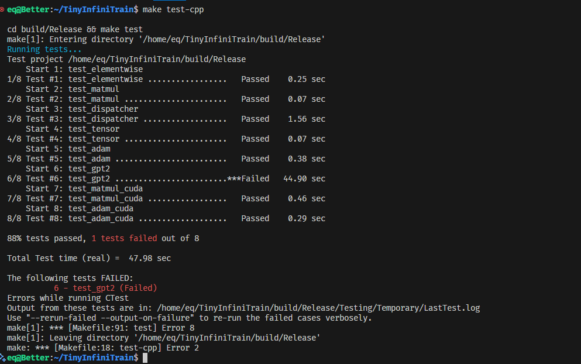
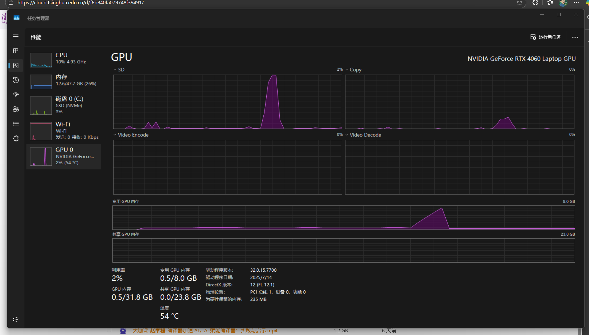

# TinyInfiniTrain 作业报告

## 一、test 通过截图



## 二、作业步骤

> 将代码填入下面代码块中指定位置，并详细描述完成该作业的解决思路和遇到的问题。

### 作业一：autograd机制调用Neg kernel的实现

难度：⭐

对应测例：`TEST(ElementwiseTest, NegForward)`，`TEST(ElementwiseTest, NegBackward)`

需要实现的代码块位置：`infini_train/src/autograd/elementwise.cc`

```c++
std::vector<std::shared_ptr<Tensor>> Neg::Forward(const std::vector<std::shared_ptr<Tensor>> &input_tensors) {
    // =================================== 作业 ===================================
    CHECK_EQ(input_tensors.size(), 1);
    const auto &input = input_tensors[0];

    auto device = input->GetDevice().Type();
    auto kernel = Dispatcher::Instance().GetKernel({device, "NegForward"});
    return {kernel.Call<std::shared_ptr<Tensor>>(input)};
}

std::vector<std::shared_ptr<Tensor>> Neg::Backward(const std::vector<std::shared_ptr<Tensor>> &grad_outputs) {
    // =================================== 作业 ===================================
    CHECK_EQ(grad_outputs.size(), 1);
    const auto &grad_output = grad_outputs[0];

    auto device = grad_output->GetDevice().Type();
    auto kernel = Dispatcher::Instance().GetKernel({device, "NegBackward"});
    return {kernel.Call<std::shared_ptr<Tensor>>(grad_output)};
}
```

#### 解决思路

`input_tensors`作为参数，通过Dispatcher调用NegBackward的计算Kernel获取结果即可

#### 遇到问题

无

### 作业二：实现矩阵乘法

难度：⭐⭐

#### CPU实现

对应测例：`TEST(MatmulTest, BasicMatrixMultiply)`，`TEST(MatmulTest, BatchedMatrixMultiply)`, `TEST(MatmulTest, BackwardPass)`

需要实现的代码块位置：`infini_train/src/kernels/cpu/linear.cc`

```c++
std::shared_ptr<Tensor> MatmulForward(const std::shared_ptr<Tensor> &input, const std::shared_ptr<Tensor> &other) {
    // =================================== 作业 ===================================
    /*
    output[*, m, n] = input[*, m, k] * other[*, k, n]
    */
    // TODO(dcj): support broadcast later
    const auto &input_dims = input->Dims();
    const auto &other_dims = other->Dims();

    CHECK_GE(input_dims.size(), 2);
    CHECK_GE(other_dims.size(), 2);
    CHECK_EQ(input_dims.size(), other_dims.size());

    const int64_t m = input_dims[input_dims.size() - 2];
    const int64_t k = input_dims[input_dims.size() - 1];
    CHECK_EQ(k, other_dims[other_dims.size() - 2]);
    const int64_t n = other_dims[other_dims.size() - 1];

    const int64_t bs = std::accumulate(input_dims.rbegin() + 2, input_dims.rend(), 1, std::multiplies<int64_t>{});
    for (int64_t i = 0; i < input_dims.size() - 2; ++i) {
        CHECK_EQ(input_dims[i], other_dims[i]) << "Batch dims must match";
    }

    std::vector<int64_t> output_dims = input_dims;
    output_dims[output_dims.size() - 1] = n;
    auto output = std::make_shared<Tensor>(output_dims, DataType::kFLOAT32);

    for (int64_t b = 0; b < bs; ++b) {
        for (int64_t i = 0; i < m; ++i) {
            for (int64_t j = 0; j < n; ++j) {
                float acc = 0.0f;
                for (int64_t p = 0; p < k; ++p) {
                    acc += static_cast<const float *>(input->DataPtr())[b * m * k + i * k + p]
                         * static_cast<const float *>(other->DataPtr())[b * k * n + p * n + j];
                }
                static_cast<float *>(output->DataPtr())[b * m * n + i * n + j] = acc;
            }
        }
    }
    return {output};
}

MatmulBackward(const std::shared_ptr<Tensor> &input, const std::shared_ptr<Tensor> &other,
               const std::shared_ptr<Tensor> &grad_output) {
    // =================================== 作业 ===================================
    /*
    grad_input[*, m, k] = grad_output[*, m, n] * other[*, k, n]^T
    grad_other[*, k, n] = input[*, m, k]^T * grad_output[*, m, n]
    */
    const auto &input_dims = input->Dims();
    const auto &other_dims = other->Dims();
    const auto &grad_output_dims = grad_output->Dims();

    CHECK_GE(input_dims.size(), 2);
    CHECK_EQ(input_dims.size(), other_dims.size());
    CHECK_EQ(input_dims.size(), grad_output_dims.size());

    const int64_t m = input_dims[input_dims.size() - 2];
    const int64_t k = input_dims[input_dims.size() - 1];
    CHECK_EQ(k, other_dims[other_dims.size() - 2]);
    const int64_t n = other_dims[other_dims.size() - 1];
    CHECK_EQ(m, grad_output_dims[grad_output_dims.size() - 2]);
    CHECK_EQ(n, grad_output_dims[grad_output_dims.size() - 1]);

    const int64_t bs = std::accumulate(input_dims.rbegin() + 2, input_dims.rend(), 1, std::multiplies<int64_t>{});
    for (int64_t i = 0; i < input_dims.size() - 2; ++i) {
        CHECK_EQ(input_dims[i], other_dims[i]) << "Batch dims must match";
        CHECK_EQ(input_dims[i], grad_output_dims[i]) << "Batch dims must match";
    }

    auto grad_input = std::make_shared<Tensor>(input_dims, DataType::kFLOAT32);
    auto grad_other = std::make_shared<Tensor>(other_dims, DataType::kFLOAT32);
    grad_input->Fill<float>(0.0f);
    grad_other->Fill<float>(0.0f);

    for (int64_t b = 0; b < bs; ++b) {
        for (int64_t i = 0; i < m; ++i) {
            for (int64_t j = 0; j < n; ++j) {
                const float grad = static_cast<float *>(grad_output->DataPtr())[b * m * n + i * n + j];
                for (int64_t p = 0; p < k; ++p) {
                    const auto input_idx = b * m * k + i * k + p;
                    const auto other_idx = b * k * n + p * n + j;
                    static_cast<float *>(grad_input->DataPtr())[input_idx]
                        += grad * static_cast<const float *>(other->DataPtr())[other_idx];
                    static_cast<float *>(grad_other->DataPtr())[other_idx]
                        += grad * static_cast<const float *>(input->DataPtr())[input_idx];
                }
            }
        }
    }
    return {grad_input, grad_other};
}
```

#### CUDA实现

对应测例：`TEST(MatmulTest, BasicMatrixMultiplyCuda)`,`TEST(MatmulTest, BatchedMatrixMultiplyCuda)`,`TEST(MatmulTest, BackwardPassCuda)`

需要实现的代码块位置：`infini_train/src/kernels/cuda/linear.cu`

```c++
std::shared_ptr<Tensor> MatmulForward(const std::shared_ptr<Tensor> &input, const std::shared_ptr<Tensor> &other) {
    // =================================== 作业 ===================================
    /*
     output[*, m, n] = input[*, m, k] * other[*, k, n]
     */
    const auto &input_dims = input->Dims();
    const auto &other_dims = other->Dims();

    CHECK_GE(input_dims.size(), 2);
    CHECK_GE(other_dims.size(), 2);
    CHECK_EQ(input_dims.size(), other_dims.size());

    const int64_t m = input_dims[input_dims.size() - 2];
    const int64_t k = input_dims[input_dims.size() - 1];
    CHECK_EQ(k, other_dims[other_dims.size() - 2]);
    const int64_t n = other_dims[other_dims.size() - 1];

    const int64_t bs = std::accumulate(input_dims.rbegin() + 2, input_dims.rend(), 1, std::multiplies<int64_t>{});
    for (int64_t i = 0; i < input_dims.size() - 2; ++i) {
        CHECK_EQ(input_dims[i], other_dims[i]) << "Batch dims must match";
    }

    auto dtype = input->Dtype();
    std::vector<int64_t> output_dims = input_dims;
    output_dims[output_dims.size() - 1] = n;
    auto output = std::make_shared<Tensor>(output_dims, dtype, input->GetDevice());

    const auto *cuda_device = dynamic_cast<const CudaDevice *>(
        DeviceManager::Instance()->GetDevice(DeviceType::kCUDA, input->GetDevice().Index()));
    const float alpha = 1.0f, beta = 0.0f;
    cublasHandle_t handle = cuda_device->CublasHandle();

    // cuBLAS is colmun-major
    // output = input * other --> output.T = other.T * input.T
    // C = A * B ==> output.T[*, n, m] = other.T[*, n, k] * input.T[*, k, m]
    // C = output.T[*, n, m]
    // A = other.T[*, n, k]
    // B = input.T[*, k, m]
    int lda = n;
    int ldb = k;
    int ldc = n;
    int64_t stride_a = n * k;
    int64_t stride_b = k * m;
    int64_t stride_c = m * n;
    // NOTE(zbl): the last cublasGemmAlgo_t param has no effect on GPU arch >= sm_80(Ampere)

    switch (dtype) {
        DISPATCH_CASE(WRAP(CUBLAS_CHECK(cublasGemmStridedBatchedEx(
                          handle, CUBLAS_OP_N, CUBLAS_OP_N, n, m, k, &alpha, other->DataPtr(), CUDA_R_32F, lda,
                          stride_a, input->DataPtr(), CUDA_R_32F, ldb, stride_b, &beta, output->DataPtr(), CUDA_R_32F,
                          ldc, stride_c, bs, CUDA_R_32F, CUBLAS_GEMM_DEFAULT));),
                      DataType::kFLOAT32)
        DISPATCH_CASE(WRAP(CUBLAS_CHECK(cublasGemmStridedBatchedEx(
                          handle, CUBLAS_OP_N, CUBLAS_OP_N, n, m, k, &alpha, other->DataPtr(), CUDA_R_16BF, lda,
                          stride_a, input->DataPtr(), CUDA_R_16BF, ldb, stride_b, &beta, output->DataPtr(), CUDA_R_16BF,
                          ldc, stride_c, bs, CUDA_R_32F, CUBLAS_GEMM_DEFAULT));),
                      DataType::kBFLOAT16)
    default:
        LOG_UNSUPPORTED_DTYPE(dtype, "CUDA MatmulForward");
    }

    return output;
}

MatmulBackward(const std::shared_ptr<Tensor> &input, const std::shared_ptr<Tensor> &other,
               const std::shared_ptr<Tensor> &grad_output) {
    // =================================== 作业 ===================================
    /*
       grad_input[*, m, k] = grad_output[*, m, n] * other[*, k, n]^T
       grad_other[*, k, n] = input[*, m, k]^T * grad_output[*, m, n]
    */
    const auto &input_dims = input->Dims();
    const auto &other_dims = other->Dims();
    const auto &grad_output_dims = grad_output->Dims();

    CHECK_GE(input_dims.size(), 2);
    CHECK_EQ(input_dims.size(), other_dims.size());
    CHECK_EQ(input_dims.size(), grad_output_dims.size());

    const int64_t m = input_dims[input_dims.size() - 2];
    const int64_t k = input_dims[input_dims.size() - 1];
    const int64_t n = other_dims[other_dims.size() - 1];
    CHECK_EQ(k, other_dims[other_dims.size() - 2]);
    CHECK_EQ(m, grad_output_dims[grad_output_dims.size() - 2]);
    CHECK_EQ(n, grad_output_dims[grad_output_dims.size() - 1]);

    const int64_t bs = std::accumulate(input_dims.rbegin() + 2, input_dims.rend(), 1, std::multiplies<int64_t>{});
    for (int64_t i = 0; i < input_dims.size() - 2; ++i) {
        CHECK_EQ(input_dims[i], other_dims[i]) << "Batch dims must match";
        CHECK_EQ(input_dims[i], grad_output_dims[i]) << "Batch dims must match";
    }

    auto dtype = input->Dtype();
    auto grad_input = std::make_shared<Tensor>(input_dims, dtype, grad_output->GetDevice());
    auto grad_other = std::make_shared<Tensor>(other_dims, dtype, grad_output->GetDevice());

    DispatchFunc<DataType::kFLOAT32, DataType::kBFLOAT16>(
        dtype,
        [=]<typename T>() {
            grad_input->Fill<T>(0);
            grad_other->Fill<T>(0);
        },
        "CUDA MatmulBackward");

    const auto *cuda_device = dynamic_cast<const CudaDevice *>(
        DeviceManager::Instance()->GetDevice(DeviceType::kCUDA, input->GetDevice().Index()));
    const float alpha = 1.0f, beta = 0.0f;
    cublasHandle_t handle = cuda_device->CublasHandle();

    {
        // cuBLAS is colmun-major
        // grad_input = grad_output * other.T --> grad_input.T = other * grad_output.T
        // C = A.T * B ==> grad_input.T[*, k, m] = other[*, k, n] * grad_output.T[*, n, m]
        // C = grad_input.T[*, k, m]
        // A = other.T[*, n, k]
        // B = grad_output.T[*, n, m]
        const int lda = n, ldb = n, ldc = k;
        const int64_t stride_a = k * n;
        const int64_t stride_b = n * m;
        const int64_t stride_c = m * k;
        switch (dtype) {
            DISPATCH_CASE(WRAP(CUBLAS_CHECK(cublasGemmStridedBatchedEx(
                              handle, CUBLAS_OP_T, CUBLAS_OP_N, k, m, n, &alpha, other->DataPtr(), CUDA_R_32F, lda,
                              stride_a, grad_output->DataPtr(), CUDA_R_32F, ldb, stride_b, &beta, grad_input->DataPtr(),
                              CUDA_R_32F, ldc, stride_c, bs, CUDA_R_32F, CUBLAS_GEMM_DEFAULT));),
                          DataType::kFLOAT32)
            DISPATCH_CASE(
                WRAP(CUBLAS_CHECK(cublasGemmStridedBatchedEx(
                    handle, CUBLAS_OP_T, CUBLAS_OP_N, k, m, n, &alpha, other->DataPtr(), CUDA_R_16BF, lda, stride_a,
                    grad_output->DataPtr(), CUDA_R_16BF, ldb, stride_b, &beta, grad_input->DataPtr(), CUDA_R_16BF, ldc,
                    stride_c, bs, CUDA_R_32F, CUBLAS_GEMM_DEFAULT));),
                DataType::kBFLOAT16)
        }
    }

    {
        // cuBLAS is colmun-major
        // grad_other = input.T * grad_output --> grad_other.T =  grad_output.T * input
        // C = A * B.T ==> grad_other.T[*, n, k] = grad_output.T[*, n, m] * input[*, m, k]
        // C = grad_other.T[*, n, k]
        // A = grad_output.T[*, n, m]
        // B = input.T[*, k, m]
        const int lda = n, ldb = k, ldc = n;
        const int64_t stride_a = n * m;
        const int64_t stride_b = k * m;
        const int64_t stride_c = n * k;
        switch (dtype) {
            DISPATCH_CASE(WRAP(CUBLAS_CHECK(cublasGemmStridedBatchedEx(
                              handle, CUBLAS_OP_N, CUBLAS_OP_T, n, k, m, &alpha, grad_output->DataPtr(), CUDA_R_32F,
                              lda, stride_a, input->DataPtr(), CUDA_R_32F, ldb, stride_b, &beta, grad_other->DataPtr(),
                              CUDA_R_32F, ldc, stride_c, bs, CUDA_R_32F, CUBLAS_GEMM_DEFAULT));),
                          DataType::kFLOAT32)
            DISPATCH_CASE(WRAP(CUBLAS_CHECK(cublasGemmStridedBatchedEx(
                              handle, CUBLAS_OP_N, CUBLAS_OP_T, n, k, m, &alpha, grad_output->DataPtr(), CUDA_R_16BF,
                              lda, stride_a, input->DataPtr(), CUDA_R_16BF, ldb, stride_b, &beta, grad_other->DataPtr(),
                              CUDA_R_16BF, ldc, stride_c, bs, CUDA_R_32F, CUBLAS_GEMM_DEFAULT));),
                          DataType::kBFLOAT16)
        }
    }

    return {grad_input, grad_other};
}
```

#### 解决思路

主要是复制粘贴了InfiniTrain中提供的代码，CPU实现比较直观，直接使用for循环实现矩阵的乘法，但是唯一的问题在于TinyInfiniTrain中的GetDevice()的返回值与InfiniTrain中GetDevice()的返回值不同
```c++
    const auto *cuda_device = dynamic_cast<const CudaDevice *>(
        DeviceManager::Instance()->GetDevice(DeviceType::kCUDA, input->GetDevice().Index()));
```

#### 遇到问题

无

### 作业三：实现Adam优化器

难度：⭐

#### CPU实现

对应测例：`TEST(AdamOptimizerTest, BasicParameterUpdate)`,`TEST(AdamOptimizerTest, MomentumAccumulation)`

代码位置：infini_train/src/kernels/cpu/accumulate_grad.cc

```c++
void AdamAccumulateGrad(const std::shared_ptr<Tensor> &grad, const std::shared_ptr<Tensor> &param,
                        const std::shared_ptr<Tensor> &m, const std::shared_ptr<Tensor> &v, float learning_rate,
                        float beta1, float beta2, float eps, int64_t t) {
    // =================================== 作业 ===================================
    const float *grad_data = static_cast<const float *>(grad->DataPtr());
    float *m_data = static_cast<float *>(m->DataPtr());
    float *v_data = static_cast<float *>(v->DataPtr());
    float *param_data = static_cast<float *>(param->DataPtr());

    const float bias_correction_m = 1.0f - std::pow(beta1, t);
    const float bias_correction_v = 1.0f - std::pow(beta2, t);

#pragma omp parallel for
    for (size_t idx = 0; idx < grad->NumElements(); ++idx) {
        m_data[idx] = beta1 * m_data[idx] + (1 - beta1) * grad_data[idx];
        v_data[idx] = beta2 * v_data[idx] + (1 - beta2) * grad_data[idx] * grad_data[idx];

        const float m_hat = m_data[idx] / bias_correction_m;
        const float v_hat = v_data[idx] / bias_correction_v;

        param_data[idx] -= learning_rate * m_hat / (std::sqrt(v_hat) + eps);
    }
}
```

#### CUDA实现

对应测例：`TEST(AdamOptimizerTest, BasicParameterUpdateCuda)`,`TEST(AdamOptimizerTest, MomentumAccumulationCuda)`

代码位置：infini_train/src/kernels/cuda/accumulate_grad.cu

```c++
template <typename T>
__global__ void AdamAccumulateGradKernel(const T *grad_data, T *param_data, size_t num_elements, T *m_data, T *v_data,
                                         float learning_rate, float beta1, float beta2, float eps,
                                         const float bias_correction_m, const float bias_correction_v) {
    size_t idx = blockIdx.x * blockDim.x + threadIdx.x;
    if (idx < num_elements) {
        m_data[idx] = common::cuda::Fma(common::cuda::Cast<T>(beta1), m_data[idx],
                                        common::cuda::Cast<T>(1 - beta1) * grad_data[idx]);
        v_data[idx] = common::cuda::Fma(common::cuda::Cast<T>(beta2), v_data[idx],
                                        common::cuda::Cast<T>(1 - beta2) * grad_data[idx] * grad_data[idx]);

        const float m_hat = common::cuda::Cast<float>(m_data[idx]) / bias_correction_m;
        const float v_hat = common::cuda::Cast<float>(v_data[idx]) / bias_correction_v;

        param_data[idx] = common::cuda::Sub(
            param_data[idx], common::cuda::Cast<T>(learning_rate * m_hat * __frcp_rn(__fsqrt_rn(v_hat) + eps)));
    }
}

void AdamAccumulateGrad(const std::shared_ptr<Tensor> &grad, const std::shared_ptr<Tensor> &param,
                        const std::shared_ptr<Tensor> &m, const std::shared_ptr<Tensor> &v, float learning_rate,
                        float beta1, float beta2, float eps, int64_t t) {
    // =================================== 作业 ===================================
    // TODO：实现Adam优化器的梯度累积和参数更新
    // REF:
    // =================================== 作业 ===================================
    size_t num_elements = grad->NumElements();

    const float bias_correction_m = 1.0f - std::pow(beta1, t);
    const float bias_correction_v = 1.0f - std::pow(beta2, t);

    int threads_per_block = 256;
    int num_blocks = (num_elements + threads_per_block - 1) / threads_per_block;
    const auto *cuda_device = dynamic_cast<const CudaDevice *>(
        DeviceManager::Instance()->GetDevice(DeviceType::kCUDA, grad->GetDevice().Index()));

    DispatchFunc<INFINI_ALL_FLOATING_TYPES>(
        grad->Dtype(),
        [=]<typename T>() {
            AdamAccumulateGradKernel<<<num_blocks, threads_per_block, 0, cuda_device->Stream()>>>(
                static_cast<const T *>(grad->DataPtr()), static_cast<T *>(param->DataPtr()), num_elements,
                static_cast<T *>(m->DataPtr()), static_cast<T *>(v->DataPtr()), learning_rate, beta1, beta2, eps,
                bias_correction_m, bias_correction_v);
        },
        "CUDA AdamAccumulateGrad");
}
```

#### 解决思路

模仿InfiniTrain中的实现

#### 遇到问题

无

### 作业四：实现Tensor基础操作

#### 实现Tensor的Flatten操作

难度：⭐

对应测例：`TEST(TensorTransformTest, Flatten2DTo1D)`,`TEST(TensorTransformTest, FlattenWithRange) `,`TEST(TensorTransformTest, FlattenNonContiguous)`

代码位置：infini_train/src/tensor.cc

```c++
std::shared_ptr<Tensor> Tensor::Flatten(int64_t start, int64_t end) {
    // return Contiguous()->View(new_shape);
    // =================================== 作业 ===================================
    auto ndim = dims_.size();
    auto start_dim = start >= 0 ? start : start + ndim;
    auto end_dim = end >= 0 ? end : end + ndim;
    CHECK(start_dim >= 0 && end_dim >= start_dim && end_dim <= ndim);

    std::vector<int64_t> new_shape;
    int64_t flatten_size = 1;
    for (int64_t i = 0; i < ndim; ++i) {
        if (i < start_dim || i > end_dim) {
            new_shape.push_back(dims_[i]);
        } else {
            flatten_size *= dims_[i];
            if (i == end_dim) {
                new_shape.push_back(flatten_size);
            }
        }
    }

    return Contiguous()->View(new_shape);
}
```

#### 实现Tensor的反向传播机制

难度：⭐

对应测例：`TEST(TensorAutogradTest, BackwardComputesGradient)`,`TEST(TensorAutogradTest, BackwardWithMultipleOutputs)`

代码位置：infini_train/src/tensor.cc

```c++
void Tensor::Backward(std::shared_ptr<Tensor> gradient, bool retain_graph, bool create_graph) const {
    // =================================== 作业 ===================================
    CHECK(!retain_graph && !create_graph) << "Not implemented yet!";
    if (grad_fn_) {
        if (!gradient) {
            CHECK_EQ(dims_.size(), 0);
            gradient = std::make_shared<Tensor>(std::vector<int64_t>{}, dtype_, GetDevice());
            gradient->Fill<float>(1.0f);
        } else {
            CHECK_EQ(static_cast<int>(GetDevice().Type()), static_cast<int>(gradient->GetDevice().Type()));
            CHECK_EQ(static_cast<int>(dtype_), static_cast<int>(gradient->Dtype()));
            CHECK_EQ(dims_.size(), gradient->Dims().size());
            for (int idx = 0; idx < dims_.size(); ++idx) { CHECK_EQ(dims_[idx], gradient->Dims()[idx]); }
        }
        grad_fn_->BackwardPartial(gradient, output_idx_);
    }
}
```

#### 解决思路

模仿InfiniTrain中的实现

#### 遇到问题

无

### 作业五 注册算子kernel的实现

难度：⭐⭐⭐

对应测例：`TEST(DispatcherTest, RegisterAndGetKernel)`,`TEST(DispatcherTest, DuplicateRegistration)`,`TEST(DispatcherTest, GetNonexistentKernel)`

代码位置：infini_train/include/dispatcher.h

```c++
    template <typename RetT, class... ArgsT> RetT Call(ArgsT... args) const {
        // =================================== 作业 ===================================
#ifdef PROFILE_MODE
        const auto &ctx = GetProfileContext();
        Profiler::Instance().StartRecord(ctx.name, ctx.device);
#endif

        using FuncT = RetT (*)(ArgsT...);
        auto fn = reinterpret_cast<FuncT>(func_ptr_);

        if constexpr (std::is_void_v<RetT>) {
            fn(std::forward<ArgsT>(args)...);

#ifdef PROFILE_MODE
            Profiler::Instance().EndRecord(ctx.name, ctx.device);
#endif
            return;
        } else {
            RetT ret = fn(std::forward<ArgsT>(args)...);

#ifdef PROFILE_MODE
            Profiler::Instance().EndRecord(ctx.name, ctx.device);
#endif
            return ret;
        }
    }

    template <typename FuncT> void Register(const KeyT &key, FuncT &&kernel) {
        // =================================== 作业 ===================================
        // TODO：实现kernel注册机制
        // 功能描述：将kernel函数与设备类型、名称绑定
        // =================================== 作业 ===================================
        CHECK(!key_to_kernel_map_.contains(key))
            << "Kernel already registered: " << key.second << " on device: " << static_cast<int>(key.first);
        key_to_kernel_map_.emplace(key, kernel);
    }

#define REGISTER_KERNEL(device, kernel_name, kernel_func)                                                              \
    static const bool _##kernel_name##_registered##__COUNTER__ = []() {                                                \
        infini_train::Dispatcher::Instance().Register({device, #kernel_name}, kernel_func);                            \
        return true;                                                                                                   \
    }();
```

#### 解决思路

模仿InfiniTrain中的实现

#### 遇到问题

无

### 作业六：实现GPT-2整体训练

难度：⭐⭐⭐⭐

对应测例：`TEST_F(GPT2TrainingTest, LogitsConsistency)`

#### 训练过程logits对比

完成以上所有作业，补齐训练框架的所有实现，理论上`TEST_F(GPT2TrainingTest, LogitsConsistency)`可以通过，在用例中判断比较预置的值和单步正向传播计算结果是否在误差允许范围内相等。

#### 数据读取实现

代码位置：example/common/tiny_shakespeare_dataset.cc

```c++
TinyShakespeareFile ReadTinyShakespeareFile(const std::string &path, size_t sequence_length) {
    /* =================================== 作业 ===================================
       TODO：实现二进制数据集文件解析
       文件格式说明：
    ----------------------------------------------------------------------------------
    | HEADER (1024 bytes)                     | DATA (tokens)                        |
    | magic(4B) | version(4B) | num_toks(4B) | reserved(1012B) | token数据           |
    ----------------------------------------------------------------------------------
       =================================== 作业 =================================== */
    if (!std::filesystem::exists(path)) {
        LOG(FATAL) << "File not found: " << path;
    }

    TinyShakespeareFile text_file;
    std::ifstream ifs(path, std::ios::binary);
    const auto header = ReadSeveralBytesFromIfstream(1024, &ifs);
    const int magic = BytesToType<int32_t>(header, 0);
    const int version = BytesToType<int32_t>(header, 4);
    const int num_tokens = BytesToType<int32_t>(header, 8);
    text_file.type = kTypeMap.at(magic);

    const int num_sequences = num_tokens / sequence_length;
    text_file.dims.assign({num_sequences, static_cast<int64_t>(sequence_length)});

    const int data_size_in_bytes
        = kTypeToSize.at(text_file.type)
        * std::accumulate(text_file.dims.begin(), text_file.dims.end(), 1, std::multiplies<int>());
    // shape: (num_seq, seq_len), dtype: int64
    text_file.tensor = infini_train::Tensor(text_file.dims, DataType::kINT64);
    int64_t *dst = static_cast<int64_t *>(text_file.tensor.DataPtr());

    std::variant<std::vector<uint16_t>, std::vector<int32_t>> buffer;
    if (text_file.type == TinyShakespeareType::kUINT16) {
        CHECK_LE(sequence_length, 1024); // GPT-2: max_seq_length = 1024
        buffer = std::vector<uint16_t>(num_sequences * sequence_length);
    } else if (text_file.type == TinyShakespeareType::kUINT32) {
        CHECK_LE(sequence_length, 8192); // LLaMA-3: max_seq_length = 8192
        buffer = std::vector<int32_t>(num_sequences * sequence_length);
    }
    std::visit(
        [&](auto &vec) {
            ifs.read(reinterpret_cast<char *>(vec.data()), data_size_in_bytes);
            for (size_t i = 0; i < vec.size(); ++i) { dst[i] = static_cast<int64_t>(vec[i]); }
        },
        buffer);
    return text_file;
}

TinyShakespeareDataset::TinyShakespeareDataset(const std::string &filepath, size_t sequence_length)
    : text_file_(ReadTinyShakespeareFile(filepath, sequence_length)), sequence_length_(sequence_length),
      sequence_size_in_bytes_(sequence_length * sizeof(int64_t)), num_samples_(text_file_.dims[0] - 1) {
    // =================================== 作业 ===================================
    // TODO：初始化数据集实例
    // HINT: 调用ReadTinyShakespeareFile加载数据文件
    // =================================== 作业 ===================================
    CHECK_EQ(text_file_.dims[1], sequence_length_);
    CHECK_EQ(static_cast<int>(text_file_.tensor.Dtype()), static_cast<int>(DataType::kINT64));
}
```

#### Tokenizer功能实现

代码位置：example/common/tokenizer.cc

```c++
Tokenizer::Tokenizer(const std::string &filepath) {
    /* ===================================== 作业 =====================================
    TODO：实现Tokenizer二进制文件加载

    文件格式说明：
    ----------------------------------------------------------------------------------
    | HEADER (1024 bytes)                     | VOCAB TABLE                           |
    | magic(4B) | version(4B) | vocab_size(4B) | reserved(1012B) | token词表数据       |
    ----------------------------------------------------------------------------------
    ===================================== 作业 ===================================== */
    if (!std::filesystem::exists(filepath)) {
        LOG(FATAL) << "File not found: " << filepath;
    }

    std::ifstream ifs(filepath, std::ios::binary);
    const auto header = ReadSeveralBytesFromIfstream(1024, &ifs);

    magic_number_ = BytesToType<uint32_t>(header, 0);
    const uint32_t version_num = BytesToType<uint32_t>(header, 4);
    vocab_size_ = BytesToType<uint32_t>(header, 8);
    if (kEotMap.find(magic_number_) == kEotMap.end()) {
        LOG(FATAL) << "Unsupported tokenizer magic: " << magic_number_;
    }

    Version version = static_cast<Version>(version_num);
    if (version == Version::kV1) {
        eot_token_ = kEotMap.at(magic_number_);
    } else if (version == Version::kV2) {
        const uint32_t eot_token_2 = BytesToType<uint32_t>(header, 12);
        eot_token_ = eot_token_2;
    } else {
        LOG(FATAL) << "Unsupported tokenizer version: " << version_num;
        return;
    }

    token_table_.resize(vocab_size_);
    for (uint32_t i = 0; i < vocab_size_; ++i) {
        uint8_t length;
        ifs.read(reinterpret_cast<char *>(&length), sizeof(length));

        std::vector<char> buffer(length);
        ifs.read(buffer.data(), length);

        token_table_[i] = std::string(buffer.data(), length);
    }
}
```

```c++
std::string Tokenizer::Decode(uint32_t token_id) const {
    /* ===================================== 作业 =====================================
    TODO：实现token_id到文本的转换
    功能描述：根据token_id返回对应的文本片段
    ===================================== 作业 ===================================== */
    if (token_id >= vocab_size_) {
        return "[INVALID_TOKEN]";
    }
    return token_table_[token_id];   
}
```

```c++
void Tokenizer::GenerateText(infini_train::nn::Module &model, uint32_t batch_size, uint32_t sequence_length,
                             uint32_t text_length, Device device) const {
    std::vector<int64_t> dims;
    dims.assign({batch_size, sequence_length});
    // x_tensor (FLAGS_batch_size, FLAGS_sequence_length) eq:(4, 64)
    infini_train::Tensor x_tensor = infini_train::Tensor(dims, DataType::kINT64);
    int64_t *x_buff = static_cast<int64_t *>(x_tensor.DataPtr());
    for (int i = 0; i < batch_size * sequence_length; ++i) { x_buff[i] = eot_token_; }

    // Give some contexts: "The meaning of life is "
    auto prompt = kPromptMap.at(magic_number_);
    auto prompt_len = prompt.size();
    for (int i = 0; i < prompt_len; ++i) { x_buff[i] = prompt[i]; }
    std::cout << "The meaning of life is";

    auto x = std::make_shared<infini_train::Tensor>(x_tensor.To(device));
    uint64_t kRngState = kRngState;
    LOG(INFO) << "start generate text:";

    infini_train::Device cpu_device = infini_train::Device(infini_train::DeviceType::kCPU, 0);
    for (int t = prompt_len; t < text_length; t++) {
        /* ===================================== 作业 =====================================
        TODO：实现单步文本生成逻辑
        HINT：调用model.Forward推理获取logits，根据推理结果进行随机采样，调用Decode获取文本结果
        ===================================== 作业 ===================================== */
        x = std::make_shared<infini_train::Tensor>(x->To(device)); // CPU->calc device
        // TODO(jym): use no_grad forward later
        auto logits = model.Forward({x})[0];
        auto logits_orignal = nn::function::Softmax(logits, -1);
        auto logits_cpu = logits_orignal->To(cpu_device);
        auto data = logits_cpu.DataPtr();
        auto vocab_size = logits->Dims()[2];
        float *probs = static_cast<float *>(data) + (t - 1) * vocab_size;
        float coin = RandomF32(kRngState);
        int next_token = SampleMult(probs, vocab_size, coin);

        x = std::make_shared<infini_train::Tensor>(x->To(cpu_device)); // calc device->CPU
        auto data_temp = static_cast<int64_t *>(x->DataPtr());
        data_temp[t] = next_token;
        std::cout << Decode(next_token);
    }
    std::cout << std::endl;
}
```

#### 解决思路

模仿InfiniTrian中的实现

#### 遇到问题

每当我训练无伦之后就会遇到一个奇怪的问题

```bash
Running main() from /home/eq/TinyInfiniTrain/third_party/googletest/googletest/src/gtest_main.cc
[==========] Running 1 test from 1 test suite.
[----------] Global test environment set-up.
[----------] 1 test from GPT2TrainingTest
[ RUN      ] GPT2TrainingTest.LogitsConsistency
WARNING: Logging before InitGoogleLogging() is written to STDERR
E20250807 15:20:50.757825 138590656237568 net.cc:268] magic: 20240326 version: 3 block_size: 1024 vocab_size: 50257 n_layer: 12 n_head: 12 n_embd: 768 padded_vocab_size: 50304
I20250807 15:20:51.473057 138590656237568 test_gpt2.cc:123] Initialize() finished!
I20250807 15:20:51.473109 138590656237568 test_gpt2.cc:207] epoch: 0
I20250807 15:20:51.999021 138590656237568 test_gpt2.cc:207] epoch: 1
I20250807 15:20:52.459228 138590656237568 test_gpt2.cc:207] epoch: 2
I20250807 15:20:52.898673 138590656237568 test_gpt2.cc:207] epoch: 3
I20250807 15:20:53.339709 138590656237568 test_gpt2.cc:207] epoch: 4
I20250807 15:20:53.797280 138590656237568 test_gpt2.cc:207] epoch: 5
I20250807 15:20:54.212782 138590656237568 test_gpt2.cc:207] epoch: 6
unknown file: Failure
C++ exception with description "parallel_for failed: cudaErrorInvalidDevice: invalid device ordinal" thrown in the test body.

[  FAILED  ] GPT2TrainingTest.LogitsConsistency (46613 ms)
[----------] 1 test from GPT2TrainingTest (46613 ms total)

[----------] Global test environment tear-down
[==========] 1 test from 1 test suite ran. (46613 ms total)
[  PASSED  ] 0 tests.
[  FAILED  ] 1 test, listed below:
[  FAILED  ] GPT2TrainingTest.LogitsConsistency

 1 FAILED TEST
```

内存和GPU的记录图如下：
