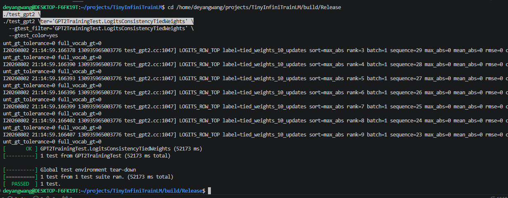

# TinyInfiniTrain 作业报告

## 一、测试通过截图



## 二、作业实现

### 作业一：autograd 机制调用 Neg kernel

源码路径：`infini_train/src/autograd/elementwise.cc`。

`Neg::Forward` 当前实现：

```cpp
std::vector<std::shared_ptr<Tensor>> Neg::Forward(const std::vector<std::shared_ptr<Tensor>> &input_tensors) {
    CHECK_EQ(input_tensors.size(), 1);
    const auto &input = input_tensors[0];

    auto device = input->GetDevice().Type();
    auto kernel = Dispatcher::Instance().GetKernel({device, "NegForward"});
    return {kernel.Call<std::shared_ptr<Tensor>>(input)};
}
```

`Neg::Backward` 当前实现：

```cpp
std::vector<std::shared_ptr<Tensor>> Neg::Backward(const std::vector<std::shared_ptr<Tensor>> &grad_outputs) {
     CHECK_EQ(grad_outputs.size(), 1);
    const auto &grad_output = grad_outputs[0];

    auto device = grad_output->GetDevice().Type();
    auto kernel =
        Dispatcher::Instance().GetKernel({device, "NegBackward"});

    return {kernel.Call<std::shared_ptr<Tensor>>(grad_output)};
}
```

实现要点：`Forward` 先检查只传入一个 Tensor，再通过 `input->GetDevice().Type()` 得到当前设备类型，用 `{device, "NegForward"}` 到 `Dispatcher` 中取设备专属 kernel，并调用该 kernel 生成取负后的输出 Tensor。`Backward` 对上游梯度执行同样的派发流程，但 kernel 名为 `"NegBackward"`。因为 `y = -x` 的导数是 `-1`，所以上游梯度 `grad_output` 需要再次取负，得到传回输入的梯度。输出 Tensor 与 autograd 图的连接由 `Function::Apply` 完成：`Apply` 调用 `Forward` 后会根据输入是否需要梯度设置输出 Tensor 的 `requires_grad`、`is_leaf=false`、`grad_fn` 和 `output_idx`。

### 作业二：实现矩阵乘法

源码路径：`infini_train/src/kernels/cpu/linear.cc`、`infini_train/src/kernels/cuda/linear.cu`。

CPU `MatmulForward` 当前实现的关键代码摘录，省略重复初始化和边界检查代码：

```cpp
const auto &input_dims = input->Dims();
const auto &other_dims = other->Dims();
const size_t rank = input_dims.size();

const int64_t M = input_dims[rank - 2];
const int64_t K = input_dims[rank - 1];
const int64_t N = other_dims[rank - 1];

int64_t batch_size = 1;
for (size_t dim = 0; dim + 2 < rank; ++dim) {
    CHECK_EQ(input_dims[dim], other_dims[dim]);
    batch_size *= input_dims[dim];
}

std::vector<int64_t> output_dims = input_dims;
output_dims[rank - 1] = N;

auto output = std::make_shared<Tensor>(
    output_dims,
    input->Dtype(),
    input->GetDevice()
);

for (int64_t batch = 0; batch < batch_size; ++batch) {
    const int64_t input_offset = batch * M * K;
    const int64_t other_offset = batch * K * N;
    const int64_t output_offset = batch * M * N;

    for (int64_t i = 0; i < M; ++i) {
        for (int64_t j = 0; j < N; ++j) {
            float sum = 0.0f;

            for (int64_t k = 0; k < K; ++k) {
                sum +=
                    input_data[input_offset + i * K + k] *
                    other_data[other_offset + k * N + j];
            }

            output_data[output_offset + i * N + j] = sum;
        }
    }
}
return output;
```

CPU `MatmulBackward` 当前实现的关键代码摘录，省略重复初始化和边界检查代码：

```cpp
const int64_t M = input_dims[rank - 2];
const int64_t K = input_dims[rank - 1];
const int64_t N = other_dims[rank - 1];

auto grad_input = std::make_shared<Tensor>(
    input_dims,
    input->Dtype(),
    input->GetDevice()
);

auto grad_other = std::make_shared<Tensor>(
    other_dims,
    other->Dtype(),
    other->GetDevice()
);

for (int64_t batch = 0; batch < batch_size; ++batch) {
    const int64_t input_offset = batch * M * K;
    const int64_t other_offset = batch * K * N;
    const int64_t grad_output_offset = batch * M * N;

    for (int64_t i = 0; i < M; ++i) {
        for (int64_t k = 0; k < K; ++k) {
            float sum = 0.0f;

            for (int64_t j = 0; j < N; ++j) {
                sum +=
                    grad_output_data[
                        grad_output_offset + i * N + j
                    ] *
                    other_data[
                        other_offset + k * N + j
                    ];
            }

            grad_input_data[
                input_offset + i * K + k
            ] = sum;
        }
    }

    for (int64_t k = 0; k < K; ++k) {
        for (int64_t j = 0; j < N; ++j) {
            float sum = 0.0f;

            for (int64_t i = 0; i < M; ++i) {
                sum +=
                    input_data[
                        input_offset + i * K + k
                    ] *
                    grad_output_data[
                        grad_output_offset + i * N + j
                    ];
            }

            grad_other_data[
                other_offset + k * N + j
            ] = sum;
        }
    }
}
return {grad_input, grad_other};
```

CUDA `MatmulForward` 当前实现的关键代码摘录，省略重复初始化和边界检查代码：

```cpp
const int64_t M =
    input_dims[input_dims.size() - 2];
const int64_t K =
    input_dims.back();
const int64_t N =
    other_dims.back();

const int64_t batch_count =
    static_cast<int64_t>(input->NumElements()) /
    (M * K);

auto output_dims = input_dims;
output_dims.back() = N;

auto output = std::make_shared<Tensor>(
    output_dims,
    DataType::kFLOAT32,
    input->GetDevice()
);

cublasHandle_t handle;
CUBLAS_CHECK(cublasCreate(&handle));

const int64_t stride_other = K * N;
const int64_t stride_input = M * K;
const int64_t stride_output = M * N;

CheckStridedBatchedGemmArgs("MatmulForward cublasSgemmStridedBatched", CUBLAS_OP_N, CUBLAS_OP_N, N, M, K, N, K,
                            N, stride_other, stride_input, stride_output, batch_count);

CUBLAS_CHECK(cublasSgemmStridedBatched(
    handle,
    CUBLAS_OP_N,
    CUBLAS_OP_N,
    static_cast<int>(N),
    static_cast<int>(M),
    static_cast<int>(K),
    &alpha,
    static_cast<const float *>(other->DataPtr()),
    static_cast<int>(N),
    stride_other,
    static_cast<const float *>(input->DataPtr()),
    static_cast<int>(K),
    stride_input,
    &beta,
    static_cast<float *>(output->DataPtr()),
    static_cast<int>(N),
    stride_output,
    static_cast<int>(batch_count)
));

CUBLAS_CHECK(cublasDestroy(handle));
```

CUDA `MatmulBackward` 当前实现的关键代码摘录，省略重复初始化和边界检查代码：

```cpp
CheckStridedBatchedGemmArgs("MatmulBackward grad_input cublasSgemmStridedBatched", CUBLAS_OP_T, CUBLAS_OP_N, K,
                            M, N, N, N, K, stride_other, stride_grad_output, stride_input, batch_count);

CUBLAS_CHECK(cublasSgemmStridedBatched(
    handle,
    CUBLAS_OP_T,
    CUBLAS_OP_N,
    static_cast<int>(K),
    static_cast<int>(M),
    static_cast<int>(N),
    &alpha,
    static_cast<const float *>(other->DataPtr()),
    static_cast<int>(N),
    stride_other,
    static_cast<const float *>(grad_output->DataPtr()),
    static_cast<int>(N),
    stride_grad_output,
    &beta,
    static_cast<float *>(grad_input->DataPtr()),
    static_cast<int>(K),
    stride_input,
    static_cast<int>(batch_count)
));

CheckStridedBatchedGemmArgs("MatmulBackward grad_other cublasSgemmStridedBatched", CUBLAS_OP_N, CUBLAS_OP_T, N,
                            K, M, N, K, N, stride_grad_output, stride_input, stride_other, batch_count);

CUBLAS_CHECK(cublasSgemmStridedBatched(
    handle,
    CUBLAS_OP_N,
    CUBLAS_OP_T,
    static_cast<int>(N),
    static_cast<int>(K),
    static_cast<int>(M),
    &alpha,
    static_cast<const float *>(grad_output->DataPtr()),
    static_cast<int>(N),
    stride_grad_output,
    static_cast<const float *>(input->DataPtr()),
    static_cast<int>(K),
    stride_input,
    &beta,
    static_cast<float *>(grad_other->DataPtr()),
    static_cast<int>(N),
    stride_other,
    static_cast<int>(batch_count)
));

CUBLAS_CHECK(cublasDestroy(handle));
```

实现要点：输入 shape 为 `[..., M, K]`，另一矩阵 shape 为 `[..., K, N]`，输出 shape 为 `[..., M, N]`。batch 维度是最后两维之前所有维度的乘积，CPU 实现逐 batch 计算 offset 后做三重循环。前向矩阵乘法为 `output[i, j] = sum_k input[i, k] * other[k, j]`。反向传播中 `grad_input = grad_output * other^T`，`grad_other = input^T * grad_output`。

CUDA 使用 `cublasSgemmStridedBatched`。框架 Tensor 按行主序理解，而 cuBLAS 按列主序解释同一段内存，因此前向把行主序的 `output[M, N]` 看作列主序的 `output^T[N, M]`，调用时令 `m=N`、`n=M`、`k=K`，A 指向 `other`，B 指向 `input`，C 指向 `output`。`transpose` 参数对应 `CUBLAS_OP_N` 或 `CUBLAS_OP_T`；`lda`、`ldb`、`ldc` 是 cuBLAS 列主序视角下 A、B、C 的 leading dimension；`strideA`、`strideB`、`strideC` 分别是相邻 batch 的元素跨度；`batch_count` 是 batched matmul 的批次数。

### 作业三：实现 Adam 优化器

源码路径：`infini_train/src/kernels/cpu/accumulate_grad.cc`、`infini_train/src/kernels/cuda/accumulate_grad.cu`。

CPU `AdamAccumulateGrad` 当前实现：

```cpp
void AdamAccumulateGrad(const std::shared_ptr<Tensor> &grad, const std::shared_ptr<Tensor> &param,
                        const std::shared_ptr<Tensor> &m, const std::shared_ptr<Tensor> &v, float learning_rate,
                        float beta1, float beta2, float eps, int64_t t) {
    CHECK_EQ(grad->NumElements(), param->NumElements());
    CHECK_EQ(m->NumElements(), param->NumElements());
    CHECK_EQ(v->NumElements(), param->NumElements());

    const auto *grad_data =
        static_cast<const float *>(grad->DataPtr());

    auto *param_data =
        static_cast<float *>(param->DataPtr());

    auto *m_data =
        static_cast<float *>(m->DataPtr());

    auto *v_data =
        static_cast<float *>(v->DataPtr());

    const float bias_correction1 =
        1.0f - std::pow(beta1, static_cast<float>(t));

    const float bias_correction2 =
        1.0f - std::pow(beta2, static_cast<float>(t));

    for (int64_t idx = 0; idx < param->NumElements(); ++idx) {
        const float gradient = grad_data[idx];

        m_data[idx] =
            beta1 * m_data[idx]
            + (1.0f - beta1) * gradient;

        v_data[idx] =
            beta2 * v_data[idx]
            + (1.0f - beta2) * gradient * gradient;

        const float m_hat =
            m_data[idx] / bias_correction1;

        const float v_hat =
            v_data[idx] / bias_correction2;

        param_data[idx] -=
            learning_rate * m_hat /
            (std::sqrt(v_hat) + eps);
    }
}
```

CUDA `AdamAccumulateGrad` 当前实现的关键代码摘录，省略重复指针转换代码：

```cpp
__global__ void AdamAccumulateGradKernel(
    const float *grad_data,
    float *param_data,
    float *m_data,
    float *v_data,
    size_t num_elements,
    float learning_rate,
    float beta1,
    float beta2,
    float eps,
    float bias_correction_m,
    float bias_correction_v
) {
    size_t idx =
        blockIdx.x * blockDim.x + threadIdx.x;

    if (idx < num_elements) {
        const float gradient = grad_data[idx];

        m_data[idx] =
            beta1 * m_data[idx]
            + (1.0f - beta1) * gradient;

        v_data[idx] =
            beta2 * v_data[idx]
            + (1.0f - beta2)
                * gradient * gradient;

        const float m_hat =
            m_data[idx] / bias_correction_m;

        const float v_hat =
            v_data[idx] / bias_correction_v;

        param_data[idx] -=
            learning_rate * m_hat /
            (__fsqrt_rn(v_hat) + eps);
    }
}
```

```cpp
size_t num_elements = grad->NumElements();

float beta1_power = 1.0f;
float beta2_power = 1.0f;

for (int64_t step = 0; step < t; ++step) {
    beta1_power *= beta1;
    beta2_power *= beta2;
}

const float bias_correction_m =
    1.0f - beta1_power;

const float bias_correction_v =
    1.0f - beta2_power;

int threads_per_block = 256;

int num_blocks =
    (num_elements + threads_per_block - 1)
    / threads_per_block;

AdamAccumulateGradKernel<<<
    num_blocks,
    threads_per_block
>>>(
    grad_data,
    param_data,
    m_data,
    v_data,
    num_elements,
    learning_rate,
    beta1,
    beta2,
    eps,
    bias_correction_m,
    bias_correction_v
);
```

数学公式与实现一致：

`m_t = beta1 * m + (1 - beta1) * grad`

`v_t = beta2 * v + (1 - beta2) * grad * grad`

`m_hat = m_t / (1 - beta1^t)`

`v_hat = v_t / (1 - beta2^t)`

`param -= learning_rate * m_hat / (sqrt(v_hat) + eps)`

CPU 版本逐元素循环更新参数。CUDA 版本中每个线程负责一个参数元素，`idx` 来自 `blockIdx.x * blockDim.x + threadIdx.x`。`m` 和 `v` 作为 Tensor 参数传入并原地更新，用于跨 optimizer step 保存一阶、二阶动量。`t` 用于计算偏差修正因子，CPU 使用 `std::pow`，CUDA wrapper 手动循环计算 `beta1^t` 和 `beta2^t`。当前 CUDA Adam wrapper 发起 kernel launch，但函数内没有显式调用 `CUDA_KERNEL_CHECK()` 或 `cudaGetLastError()`；这是当前源码的真实状态，实际错误依赖后续同步或测试暴露。

### 作业四：实现 Tensor 基础操作

源码路径：`infini_train/src/tensor.cc`。

`Tensor::Flatten` 当前实现：

```cpp
std::shared_ptr<Tensor> Tensor::Flatten(int64_t start, int64_t end) {
    const int64_t rank = static_cast<int64_t>(dims_.size());
    CHECK_GT(rank, 0);

    if (start < 0) {
        start += rank;
    }
    if (end < 0) {
        end += rank;
    }

    CHECK_GE(start, 0);
    CHECK_LT(start, rank);
    CHECK_GE(end, 0);
    CHECK_LT(end, rank);
    CHECK_LE(start, end);

    std::vector<int64_t> new_shape;
    new_shape.reserve(
        static_cast<size_t>(rank - (end - start))
    );

    for (int64_t i = 0; i < start; ++i) {
        new_shape.push_back(dims_[i]);
    }

    int64_t flattened_dim = 1;
    for (int64_t i = start; i <= end; ++i) {
        flattened_dim *= dims_[i];
    }
    new_shape.push_back(flattened_dim);

    for (int64_t i = end + 1; i < rank; ++i) {
        new_shape.push_back(dims_[i]);
    }

    return Contiguous()->View(new_shape);
}
```

`Tensor::Backward` 当前实现：

```cpp
void Tensor::Backward(std::shared_ptr<Tensor> gradient, bool retain_graph, bool create_graph) const {
    if (auto *observer = autograd::GetBackwardDiagnosticsObserver()) {
        observer->OnBackwardStart(*this);
    }
     CHECK(requires_grad_)
        << "Cannot call Backward on a tensor that does not require gradients";

    (void)retain_graph;
    (void)create_graph;

    if (!gradient) {
        CHECK_EQ(NumElements(), 1)
            << "Gradient must be provided for non-scalar tensors";

        gradient =
            std::make_shared<Tensor>(dims_, dtype_, GetDevice());
        gradient->Fill<float>(1.0f);
    }

    CHECK_EQ(gradient->NumElements(), NumElements());

    if (grad_fn_) {
        grad_fn_->BackwardPartial(gradient, output_idx_);
        if (auto *observer = autograd::GetBackwardDiagnosticsObserver()) {
            observer->OnBackwardEnd(*this);
        }
        return;
    }

    CHECK(is_leaf_);
    CHECK(grad_);

    auto device = GetDevice().Type();
    auto kernel =
        Dispatcher::Instance().GetKernel({device, "AccumulateGrad"});

    kernel.Call<void>(gradient, 1.0f, grad_);
    if (auto *observer = autograd::GetBackwardDiagnosticsObserver()) {
        observer->OnBackwardEnd(*this);
    }
}
```

`Flatten` 对 `start` 和 `end` 支持负数维度，负值先加上 rank 转成正索引，然后检查范围合法。新 shape 由三段构成：`start` 之前维度原样保留，`[start, end]` 范围内维度相乘成一个 `flattened_dim`，`end` 之后维度原样保留。返回值是 `Contiguous()->View(new_shape)`，而 `Contiguous()` 和 `View()` 当前都通过 `autograd::NoOp` 派发到 `NoOpForward`。`NoOpForward` 使用 `std::make_shared<Tensor>(*input, 0, dims)` 构造结果，因此当前实现不是在原 Tensor 对象上改 shape，而是创建共享底层存储语义的 Tensor 结果；非连续 Tensor 的测试只检查 shape 和元素数量，当前源码没有在 `Flatten` 中显式重排非连续存储。

`Backward` 要求当前 Tensor `requires_grad_` 为真。没有显式传入 gradient 时，只允许标量 Tensor 自动构造全 1 梯度；非标量必须传入梯度，并检查元素数量一致。若当前 Tensor 有 `grad_fn_`，则调用 `grad_fn_->BackwardPartial(gradient, output_idx_)` 继续沿 autograd 图传播。若是叶子节点，则通过 Dispatcher 取 `AccumulateGrad` kernel，把梯度累加到 `grad_`。多分支累加由 `Function::BackwardPartial` 维护：同一输出收到多个梯度时，会创建 `AccumulateGrad` 将后续梯度累加到已保存的 `grad_outputs_`。`retain_graph` 和 `create_graph` 在当前 `Tensor::Backward` 中被显式 `(void)`，没有实际行为。

### 作业五：注册算子 kernel

源码路径：`infini_train/include/dispatcher.h`。

`KernelFunction::Call` 当前实现：

```cpp
template <typename RetT, class... ArgsT> RetT Call(ArgsT... args) const {
    using FuncT = RetT (*)(ArgsT...);
    auto func = reinterpret_cast<FuncT>(func_ptr_);
    return func(std::forward<ArgsT>(args)...);
}
```

`Dispatcher::Register` 当前实现：

```cpp
template <typename FuncT> void Register(const KeyT &key, FuncT &&kernel) {
    CHECK(!key_to_kernel_map_.contains(key))
    << "Kernel already registered: " << key.second;

     key_to_kernel_map_.emplace(key, KernelFunction(std::forward<FuncT>(kernel)));
}
```

`REGISTER_KERNEL` 当前实现：

```cpp
#define CONCAT_IMPL(a, b) a##b
#define CONCAT(a, b) CONCAT_IMPL(a, b)

#define REGISTER_KERNEL(device, kernel_name, kernel_func)                           \
    static const bool CONCAT(kernel_registered_, __COUNTER__) = []() {             \
        infini_train::Dispatcher::Instance().Register(                             \
            {device, #kernel_name}, kernel_func);                                  \
        return true;                                                               \
    }();
```

kernel key 类型是 `std::pair<DeviceType, std::string>`，由设备类型和 kernel 名称组成，例如 `{DeviceType::kCPU, "NegForward"}`。`KernelFunction` 把函数指针 reinterpret 成 `void *` 保存，`Call<RetT, ArgsT...>` 再恢复成 `RetT (*)(ArgsT...)` 并执行。`Register` 使用 `std::map<KeyT, KernelFunction>` 存储 callable；重复注册时 `CHECK(!contains)` 触发错误，不存在 kernel 时 `GetKernel` 的 `CHECK(contains)` 触发错误。`REGISTER_KERNEL` 通过静态局部布尔对象执行 lambda，在静态初始化阶段完成自动注册；`__COUNTER__` 经 `CONCAT` 拼接到变量名里，避免同一翻译单元内注册对象重名。

### 作业六：实现 GPT-2 整体训练

源码路径：`example/common/tiny_shakespeare_dataset.cc`、`example/common/tokenizer.cc`、`example/gpt2/net.cc`、`test/example/test_gpt2.cc`。

`ReadTinyShakespeareFile` 当前实现的关键代码摘录，省略重复检查代码：

```cpp
const auto header =
    ReadSeveralBytesFromIfstream(1024, &ifs);

const int32_t magic =
    BytesToType<int32_t>(header, 0);

const int32_t version =
    BytesToType<int32_t>(header, 4);

const int32_t num_tokens =
    BytesToType<int32_t>(header, 8);

(void)version;

CHECK_GT(num_tokens, 0);

CHECK(kTypeMap.contains(magic))
    << "Unsupported dataset magic number: " << magic;

text_file.type = kTypeMap.at(magic);

const int64_t num_sequences =
    static_cast<int64_t>(
        num_tokens / sequence_length
    );

text_file.dims = {
    num_sequences,
    static_cast<int64_t>(sequence_length)
};

const size_t num_values =
    static_cast<size_t>(num_sequences)
    * sequence_length;

const size_t data_size_in_bytes =
    kTypeToSize.at(text_file.type)
    * num_values;

text_file.tensor = infini_train::Tensor(
    text_file.dims,
    DataType::kINT64
);
```

```cpp
std::visit(
    [&](auto &tokens) {
        ifs.read(
            reinterpret_cast<char *>(
                tokens.data()
            ),
            static_cast<std::streamsize>(
                data_size_in_bytes
            )
        );

        CHECK(ifs.good() || ifs.eof())
            << "Failed to read dataset tokens";

        for (
            size_t i = 0;
            i < tokens.size();
            ++i
        ) {
            destination[i] =
                static_cast<int64_t>(
                    tokens[i]
                );
        }
    },
    buffer
);
```

`TinyShakespeareDataset` 构造函数当前实现：

```cpp
TinyShakespeareDataset::TinyShakespeareDataset(const std::string &filepath, size_t sequence_length)
        : text_file_(
          ReadTinyShakespeareFile(
              filepath,
              sequence_length
          )
      ),
      sequence_length_(sequence_length),
      sequence_size_in_bytes_(
          sequence_length * sizeof(int64_t)
      ),
      num_samples_(
          text_file_.dims[0] - 1
      ) {

    CHECK_EQ(
        text_file_.dims[1],
        static_cast<int64_t>(
            sequence_length_
        )
    );

    CHECK_EQ(
        static_cast<int>(
            text_file_.tensor.Dtype()
        ),
        static_cast<int>(
            DataType::kINT64
        )
    );
}
```

`Tokenizer` 构造函数当前实现的关键代码摘录，省略重复文件检查代码：

```cpp
const auto header =
    ReadSeveralBytesFromIfstream(1024, &ifs);

magic_number_ =
    BytesToType<uint32_t>(header, 0);

const uint32_t version_number =
    BytesToType<uint32_t>(header, 4);

vocab_size_ =
    BytesToType<uint32_t>(header, 8);

CHECK(kEotMap.contains(magic_number_))
    << "Unsupported tokenizer magic: "
    << magic_number_;

const Version version =
    static_cast<Version>(version_number);

if (version == Version::kV1) {
    eot_token_ = kEotMap.at(magic_number_);
} else if (version == Version::kV2) {
    eot_token_ =
        BytesToType<uint32_t>(header, 12);
} else {
    LOG(FATAL)
        << "Unsupported tokenizer version: "
        << version_number;
}

token_table_.resize(vocab_size_);

for (uint32_t token_id = 0;
     token_id < vocab_size_;
     ++token_id) {
    uint8_t length = 0;

    ifs.read(
        reinterpret_cast<char *>(&length),
        sizeof(length)
    );

    std::vector<char> buffer(length);

    if (length > 0) {
        ifs.read(buffer.data(), length);
    }

    token_table_[token_id] =
        std::string(buffer.begin(), buffer.end());
}
```

`Tokenizer::Decode` 当前实现：

```cpp
std::string Tokenizer::Decode(uint32_t token_id) const {
     if (token_id >= vocab_size_) {
        return "[INVALID_TOKEN]";
    }
    return token_table_[token_id];
}
```

`Tokenizer::GenerateText` 生成核心逻辑当前实现的关键代码摘录，省略输入初始化代码：

```cpp
auto x = std::make_shared<infini_train::Tensor>(x_tensor.To(device));
uint64_t rng_state = kRngState;
LOG(INFO) << "start generate text:";
auto cpu_device = Device();
for (int t = prompt_len; t < text_length; t++) {
auto parameters = model.Parameters();

    std::vector<bool> requires_grad_flags;
    requires_grad_flags.reserve(parameters.size());

    for (const auto &parameter : parameters) {
        requires_grad_flags.push_back(
            parameter->requires_grad()
        );
        parameter->set_requires_grad(false);
    }

    x = std::make_shared<infini_train::Tensor>(
        x->To(device)
    );

    auto logits = model.Forward({x})[0];

    const int64_t vocab_size =
        logits->Dims()[2];

    auto current_logits = logits->Slice(
        {0, t - 1, 0},
        {1, t, vocab_size},
        {1, 1, 1}
    );

    auto probabilities =
        nn::function::Softmax(
            current_logits,
            -1
        );

    auto probabilities_cpu =
        probabilities->To(cpu_device);

    for (size_t i = 0;
         i < parameters.size();
         ++i) {
        parameters[i]->set_requires_grad(
            requires_grad_flags[i]
        );
    }

    float *probs =
        static_cast<float *>(
            probabilities_cpu.DataPtr()
        );

    float coin = RandomF32(rng_state);

    int next_token = SampleMult(
        probs,
        static_cast<int>(vocab_size),
        coin
    );

    x = std::make_shared<infini_train::Tensor>(
        x->To(cpu_device)
    );

    auto data =
        static_cast<int64_t *>(x->DataPtr());

    data[t] = next_token;

    std::cout << Decode(next_token);
}
```

数据集文件 header 为 1024 bytes，当前代码读取 `magic`、`version`、`num_tokens`，但 `version` 被 `(void)version` 标记为当前未实际使用；`magic` 通过 `kTypeMap` 判断 token 类型，GPT-2 对应 `uint16`，LLaMA 3 对应 `uint32`。token 被按 `sequence_length` 截成 `num_sequences` 行，并统一转换到 `DataType::kINT64` Tensor。`TinyShakespeareDataset::operator[]` 使用同一底层 tensor 构造输入和目标，目标 offset 比输入多 `sizeof(int64_t)`，即语言模型的 next-token 目标。

Tokenizer header 同样为 1024 bytes，读取 `magic_number_`、`version_number`、`vocab_size_`。版本 `kV1` 从 `kEotMap` 取 EOT token，版本 `kV2` 从 header offset 12 读取 EOT token；随后逐 token 读取 1 byte 长度和对应文本片段。`Decode` 越界返回 `"[INVALID_TOKEN]"`，否则返回词表字符串。文本生成时先构造输入序列，填充 EOT token 并写入固定 prompt；每个时间步临时关闭参数的 `requires_grad`，调用 `model.Forward({x})`，取最后位置 logits，做 softmax，拷回 CPU，用 `SampleMult` 随机采样下一个 token，更新输入序列并调用 `Decode` 输出文本。

GPT-2 `Forward` 在 `example/gpt2/net.cc` 中执行 token embedding、position embedding、Transformer blocks、final LayerNorm 和 `lm_head`，返回 shape 为 `[batch, sequence, vocab]` 的 logits。训练测试在 `test/example/test_gpt2.cc` 中使用 `CrossEntropyLoss`：每个 microbatch 调用 `model->Forward({x, y})` 得到 logits，`loss_fn->Forward({update_logits, y})[0]` 得到 loss，调用 `loss->Backward()`，循环完 2 个 microbatch 后执行 `optimizer->Step()`。当前 GPT-2 测试 metadata 中 optimizer 为 `SGD`，不是 Adam。

最终验收测试为 `GPT2TrainingTest.LogitsConsistencyTiedWeights`。它保留 `wte.weight` 和 `lm_head.weight` 的 weight tying，`model->Parameters()` 对共享参数去重；训练流程为 10 次 optimizer update，每次 2 个 microbatch，训练后单独执行 final forward。正式 reference metadata 为：shape `[2,64,50257]`，dtype `float32`，elements `6432896`，SHA256 `489e35ed79becf02afb58057b42e662416de36bea33301064aa8ad3f9eda8c19`。实际运行 `LogitsConsistencyTiedWeights` 得到 `max_abs=0`。

## 三、测试代码与测试方法

| 作业 | 测试文件 | TEST 或 TEST_F 名称 | 检查内容 | 实际运行命令 | 实际结果 |


| 作业一 | `test/autograd/test_elementwise.cc` | `ElementwiseTest.NegForward`、`ElementwiseTest.NegBackward` | 前向输出 `[-1, 2, 0]`；反向梯度 `[-1, -1, -1]` | `./test_elementwise --gtest_color=yes --gtest_filter=ElementwiseTest.NegForward:ElementwiseTest.NegBackward` | PASS，2 tests |
| 作业二 CPU | `test/kernels/test_matmul.cc` | `MatmulTest.BasicMatrixMultiply`、`MatmulTest.BatchedMatrixMultiply`、`MatmulTest.BackwardPass` | 2D/3D batched matmul 前向和输入、权重梯度 | `./test_matmul --gtest_color=yes --gtest_filter=MatmulTest.BasicMatrixMultiply:MatmulTest.BatchedMatrixMultiply:MatmulTest.BackwardPass` | PASS，3 tests |
| 作业二 CUDA | `test/kernels/test_matmul_cuda.cc` | `MatmulTest.BasicMatrixMultiplyCuda`、`MatmulTest.BatchedMatrixMultiplyCuda`、`MatmulTest.BackwardPassCuda` | CUDA 前向结果拷回 CPU 比较；CUDA backward 梯度比较 | `./test_matmul_cuda --gtest_color=yes --gtest_filter=MatmulTest.BasicMatrixMultiplyCuda:MatmulTest.BatchedMatrixMultiplyCuda:MatmulTest.BackwardPassCuda` | PASS，3 tests |
| 作业三 CPU | `test/optimizer/test_adam.cc` | `AdamOptimizerTest.BasicParameterUpdate`、`AdamOptimizerTest.MomentumAccumulation` | 参数变小；三步动量和偏差修正数值接近期望 | `./test_adam --gtest_color=yes --gtest_filter=AdamOptimizerTest.BasicParameterUpdate:AdamOptimizerTest.MomentumAccumulation` | PASS，2 tests |
| 作业三 CUDA | `test/optimizer/test_adam_cuda.cc` | `AdamOptimizerTest.BasicParameterUpdateCuda`、`AdamOptimizerTest.MomentumAccumulationCuda` | CUDA 参数更新后拷回 CPU；三步动量和偏差修正数值接近期望 | `./test_adam_cuda --gtest_color=yes --gtest_filter=AdamOptimizerTest.BasicParameterUpdateCuda:AdamOptimizerTest.MomentumAccumulationCuda` | PASS，2 tests |
| 作业四 | `test/tensor/test_tensor.cc` | `TensorTransformTest.Flatten2DTo1D`、`TensorTransformTest.FlattenWithRange`、`TensorTransformTest.FlattenNonContiguous`、`TensorAutogradTest.BackwardComputesGradient`、`TensorAutogradTest.BackwardWithMultipleOutputs` | Flatten shape/data；标量反传；多输出梯度累加 | `./test_tensor --gtest_color=yes --gtest_filter=TensorTransformTest.Flatten2DTo1D:TensorTransformTest.FlattenWithRange:TensorTransformTest.FlattenNonContiguous:TensorAutogradTest.BackwardComputesGradient:TensorAutogradTest.BackwardWithMultipleOutputs` | PASS，5 tests |
| 作业五 | `test/kernels/test_dispatcher.cc` | `DispatcherTest.RegisterAndGetKernel`、`DispatcherTest.DuplicateRegistration`、`DispatcherTest.GetNonexistentKernel` | 注册后调用；重复注册 death；不存在 kernel death | `./test_dispatcher --gtest_color=yes --gtest_filter=DispatcherTest.RegisterAndGetKernel:DispatcherTest.DuplicateRegistration:DispatcherTest.GetNonexistentKernel` | PASS，3 tests |
| 作业六 | `test/example/test_gpt2.cc` | `GPT2TrainingTest.LogitsConsistencyTiedWeights` | tied weights、参数去重、10 updates、final logits 与正式 reference 对齐 | `./test_gpt2 --gtest_color=yes --gtest_filter=GPT2TrainingTest.LogitsConsistencyTiedWeights` | PASS，1 test，`max_abs=0` |

作业一测试关键代码摘录：

```cpp
TEST(ElementwiseTest, NegForward) {
    auto input = std::make_shared<Tensor>(
        std::vector<int64_t>{3},
        DataType::kFLOAT32,
        Device(DeviceType::kCPU, 0)
    );
    float* data = static_cast<float*>(input->DataPtr());
    data[0] = 1.0f;
    data[1] = -2.0f;
    data[2] = 0.0f;

    autograd::Neg neg_op;
    auto outputs = neg_op.Forward({input});
    ASSERT_EQ(outputs.size(), 1);

    std::vector<float> expected = {-1.0f, 2.0f, 0.0f};
    const float* result_data = static_cast<const float*>(outputs[0]->DataPtr());

    for (size_t i = 0; i < expected.size(); ++i) {
        EXPECT_FLOAT_EQ(result_data[i], expected[i]);
    }
}

TEST(ElementwiseTest, NegBackward) {
    auto grad_output = std::make_shared<Tensor>(
        std::vector<int64_t>{3},
        DataType::kFLOAT32,
        Device(DeviceType::kCPU, 0)
    );

    float* grad_data = static_cast<float*>(grad_output->DataPtr());
    grad_data[0] = 1.0f;
    grad_data[1] = 1.0f;
    grad_data[2] = 1.0f;

    autograd::Neg neg_op;
    auto grad_inputs = neg_op.Backward({grad_output});
    ASSERT_EQ(grad_inputs.size(), 1);

    std::vector<float> expected = {-1.0f, -1.0f, -1.0f};
    const float* result_data = static_cast<const float*>(grad_inputs[0]->DataPtr());

    for (size_t i = 0; i < expected.size(); ++i) {
        EXPECT_FLOAT_EQ(result_data[i], expected[i]);
    }
}
```

作业二测试关键代码摘录：

```cpp
TEST(MatmulTest, BasicMatrixMultiply) {
    auto input = std::make_shared<Tensor>(
        std::vector<int64_t>{2, 3},
        DataType::kFLOAT32,
        Device(DeviceType::kCPU, 0)
    );
    float input_values[] = {1, 2, 3, 4, 5, 6};
    std::memcpy(input_data, input_values, std::size(input_values) * sizeof(float));

    auto other = std::make_shared<Tensor>(
        std::vector<int64_t>{3, 2},
        DataType::kFLOAT32,
        Device(DeviceType::kCPU, 0)
    );
    float other_values[] = {7, 8, 9, 10, 11, 12};
    std::memcpy(other_data, other_values, std::size(other_values) * sizeof(float));

    autograd::Matmul matmul_op;
    auto output = matmul_op.Forward({input, other});

    float expected[] = {58, 64,
                        139, 154};
    for (int i = 0; i < std::size(expected); ++i) {
        EXPECT_FLOAT_EQ(static_cast<float*>(output[0]->DataPtr())[i], expected[i]);
    }
}

TEST(MatmulTest, BackwardPass) {
    autograd::Matmul matmul_op;
    matmul_op.SetupContext({input, other}, {output_tensor});
    auto output = matmul_op.Backward({grad_output});

    float expected_grad_input[] = {2.3, 2.9, 3.5,
                                   5.3, 6.7, 8.1};
    for (int i = 0; i < std::size(expected_grad_input); ++i) {
        EXPECT_FLOAT_EQ(static_cast<float*>(output[0]->DataPtr())[i], expected_grad_input[i]);
    }

    float expected_grad_other[] = {1.3, 1.8,
                                   1.7, 2.4,
                                   2.1, 3.0};
    for (int i = 0; i < std::size(expected_grad_other); ++i) {
        EXPECT_FLOAT_EQ(static_cast<float*>(output[1]->DataPtr())[i], expected_grad_other[i]);
    }
}
```

CUDA matmul 测试关键代码摘录：

```cpp
TEST(MatmulTest, BasicMatrixMultiplyCuda) {
    auto input = std::make_shared<Tensor>(
        std::vector<int64_t>{2, 3},
        DataType::kFLOAT32,
        Device(DeviceType::kCUDA, 0)
    );
    float* input_data = static_cast<float*>(input->DataPtr());
    float input_values[] = {1, 2, 3, 4, 5, 6};
    cudaMemcpy(input_data, input_values,
              std::size(input_values) * sizeof(float),
              cudaMemcpyHostToDevice);

    auto other = std::make_shared<Tensor>(
        std::vector<int64_t>{3, 2},
        DataType::kFLOAT32,
        Device(DeviceType::kCUDA, 0)
    );
    float* other_data = static_cast<float*>(other->DataPtr());
    float other_values[] = {7, 8, 9, 10, 11, 12};
    cudaMemcpy(other_data, other_values,
              std::size(other_values) * sizeof(float),
              cudaMemcpyHostToDevice);

    autograd::Matmul matmul_op;
    auto output = matmul_op.Forward({input, other});
    auto cpu_output = output[0]->To(Device(DeviceType::kCPU, 0));

    float expected[] = {58, 64,
                        139, 154};

    for (int i = 0; i < 4; ++i) {
        EXPECT_FLOAT_EQ(static_cast<float*>(cpu_output.DataPtr())[i], expected[i]);
    }
}

TEST(MatmulTest, BatchedMatrixMultiplyCuda) {
    autograd::Matmul matmul_op;
    auto output = matmul_op.Forward({input, other});
    auto cpu_output = output[0]->To(Device(DeviceType::kCPU, 0));

    float expected[] = {22, 28, 49, 64,
                        220, 244, 301, 334};
    for (int i = 0; i < std::size(expected); ++i) {
        EXPECT_FLOAT_EQ(static_cast<float*>(cpu_output.DataPtr())[i], expected[i]);
    }
}

TEST(MatmulTest, BackwardPassCuda) {
    auto output_tensor = std::make_shared<Tensor>(std::vector<int64_t>{2, 2}, DataType::kFLOAT32);
    autograd::Matmul matmul_op;
    matmul_op.SetupContext({input, other}, {output_tensor});
    auto output = matmul_op.Backward({grad_output});
    auto grad_input = output[0]->To(Device(DeviceType::kCPU, 0));
    auto grad_other = output[1]->To(Device(DeviceType::kCPU, 0));

    float expected_grad_input[] = {2.3, 2.9, 3.5,
                                   5.3, 6.7, 8.1};
    for (int i = 0; i < std::size(expected_grad_input); ++i) {
        EXPECT_FLOAT_EQ(static_cast<float*>(grad_input.DataPtr())[i], expected_grad_input[i]);
    }

    float expected_grad_other[] = {1.3, 1.8,
                                   1.7, 2.4,
                                   2.1, 3.0};
    for (int i = 0; i < std::size(expected_grad_other); ++i) {
        EXPECT_FLOAT_EQ(static_cast<float*>(grad_other.DataPtr())[i], expected_grad_other[i]);
    }
}
```

作业三测试关键代码摘录：

```cpp
TEST(AdamOptimizerTest, BasicParameterUpdate) {
    auto param = std::make_shared<Tensor>(std::vector<int64_t>{3}, DataType::kFLOAT32);
    param->Fill(1.0f);
    param->RequiresGrad();

    auto grad = std::make_shared<Tensor>(param->Dims(), param->Dtype());
    grad->Fill(1.0f);
    float* grad_data = static_cast<float*>(param->grad()->DataPtr());
    std::memcpy(grad_data, grad->DataPtr(), grad->SizeInBytes());

    optimizers::Adam optimizer({param}, 0.001f, 0.9f, 0.999f, 1e-8);

    optimizer.Step();

    float* param_data = static_cast<float*>(param->DataPtr());
    for (int i = 0; i < 3; ++i) {
        EXPECT_LT(param_data[i], 1.0f);
    }
}

TEST(AdamOptimizerTest, MomentumAccumulation) {
    optimizers::Adam optimizer({param}, learning_rate, beta1, beta2, eps);

    std::vector<float> param_history;
    for (int i = 0; i < 3; ++i) {
        optimizer.Step();
        param_history.push_back(static_cast<float*>(param->DataPtr())[0]);
    }

    EXPECT_LT(param_history[1], param_history[0]);
    EXPECT_LT(param_history[2], param_history[1]);

    for (int t = 1; t <= 3; ++t) {
        m = beta1 * m + (1 - beta1) * 0.5f;
        v = beta2 * v + (1 - beta2) * 0.25f;
        float m_hat = m / (1.0f - std::pow(beta1, t));
        float v_hat = v / (1.0f - std::pow(beta2, t));

        expected_update -= learning_rate * m_hat / (std::sqrt(v_hat) + 1e-8f);
        EXPECT_NEAR(param_history[t-1] - 1.0f, expected_update, 1e-5);
    }
}
```

CUDA Adam 测试关键代码摘录：

```cpp
TEST(AdamOptimizerTest, BasicParameterUpdateCuda) {
    auto param = std::make_shared<Tensor>(std::vector<int64_t>{3}, DataType::kFLOAT32,
        Device(DeviceType::kCUDA, 0));
    param->Fill(1.0f);
    param->RequiresGrad();

    auto grad = std::make_shared<Tensor>(param->Dims(), param->Dtype());
    grad->Fill(1.0f);
    float* grad_data = static_cast<float*>(param->grad()->DataPtr());
    cudaMemcpy(grad_data, grad->DataPtr(), grad->SizeInBytes(), cudaMemcpyDefault);

    optimizers::Adam optimizer({param}, 0.001f, 0.9f, 0.999f, 1e-8);

    optimizer.Step();

    auto param_cpu = param->To(Device(DeviceType::kCPU, 0));
    float* param_data = static_cast<float*>(param_cpu.DataPtr());
    for (int i = 0; i < 3; ++i) {
        EXPECT_LT(param_data[i], 1.0f);
    }
}

TEST(AdamOptimizerTest, MomentumAccumulationCuda) {
    auto param = std::make_shared<Tensor>(std::vector<int64_t>{1}, DataType::kFLOAT32,
        Device(DeviceType::kCUDA, 0));
    param->Fill(1.0f);
    param->RequiresGrad();
    param->grad()->Fill(0.5f);

    float learning_rate = 1e-3, beta1 = 0.9, beta2 = 0.999, eps = 1e-8;

    optimizers::Adam optimizer({param}, learning_rate, beta1, beta2, eps);

    std::vector<float> param_history;
    for (int i = 0; i < 3; ++i) {
        optimizer.Step();
        auto param_cpu = param->To(Device(DeviceType::kCPU, 0));
        param_history.push_back(static_cast<float*>(param_cpu.DataPtr())[0]);
    }

    EXPECT_LT(param_history[1], param_history[0]);
    EXPECT_LT(param_history[2], param_history[1]);

    float m = 0, v = 0, expected_update = 0;
    for (int t = 1; t <= 3; ++t) {
        m = beta1 * m + (1 - beta1) * 0.5f;
        v = beta2 * v + (1 - beta2) * 0.25f;
        float m_hat = m / (1.0f - std::pow(beta1, t));
        float v_hat = v / (1.0f - std::pow(beta2, t));

        expected_update -= learning_rate * m_hat / (std::sqrt(v_hat) + 1e-8f);
        EXPECT_NEAR(param_history[t-1] - 1.0f, expected_update, 1e-5);
    }
}
```

作业四测试关键代码摘录：

```cpp
TEST(TensorAutogradTest, BackwardComputesGradient) {
    auto x = std::make_shared<Tensor>(std::vector<int64_t>{}, DataType::kFLOAT32);
    x->RequiresGrad();
    x->Fill(2.0f);

    auto y = x->Pow(2);

    y->Backward();

    float* grad = static_cast<float*>(x->grad()->DataPtr());
    EXPECT_FLOAT_EQ(grad[0], 4.0f);
}

TEST(TensorAutogradTest, BackwardWithMultipleOutputs) {
    auto y1 = x->Mul(2.0f);
    auto y2 = x->Pow(3);

    y1->Backward(grad1);
    y2->Backward(grad2);

    float* grad = static_cast<float*>(x->grad()->DataPtr());
    EXPECT_FLOAT_EQ(grad[0], 8.0f);
    EXPECT_FLOAT_EQ(grad[1], 8.0f);
    EXPECT_FLOAT_EQ(grad[2], 8.0f);
}

TEST(TensorTransformTest, Flatten2DTo1D) {
    auto flattened = t->Flatten(0, 1);

    EXPECT_EQ(flattened->Dims(), std::vector<int64_t>({12}));
    float* flat_data = static_cast<float*>(flattened->DataPtr());
    for (int i = 0; i < 12; ++i) {
        EXPECT_FLOAT_EQ(flat_data[i], i + 1);
    }
}

TEST(TensorTransformTest, FlattenWithRange) {
    auto result = t->Flatten(1, -1);

    EXPECT_EQ(result->Dims(), (std::vector<int64_t>{2, 12}));
}

TEST(TensorTransformTest, FlattenNonContiguous) {
    auto transposed = t->Transpose(0, 1);
    auto flattened = transposed->Flatten(0, -1);

    EXPECT_EQ(flattened->Dims(), std::vector<int64_t>{12});

    EXPECT_EQ(flattened->NumElements(), 12);
}
```

作业五测试关键代码摘录：

```cpp
void TestKernel1(float* param) { *param += 1.0f; }
int TestKernel2(int a, int b) { return a + b; }

TEST(DispatcherTest, RegisterAndGetKernel) {
    REGISTER_KERNEL(DeviceType::kCPU, TestKernel1, TestKernel1);
    REGISTER_KERNEL(DeviceType::kCUDA, TestKernel2, TestKernel2);

    auto kernel1 = Dispatcher::Instance().GetKernel({DeviceType::kCPU, "TestKernel1"});
    float val = 0.0f;
    kernel1.Call<void>(&val);
    EXPECT_FLOAT_EQ(val, 1.0f);

    auto kernel2 = Dispatcher::Instance().GetKernel({DeviceType::kCUDA, "TestKernel2"});
    EXPECT_EQ(kernel2.Call<int>(2, 3), 5);
}

TEST(DispatcherTest, DuplicateRegistration) {
    EXPECT_DEATH(
        REGISTER_KERNEL(DeviceType::kCPU, TestKernel, TestKernel1),
        "Kernel already registered"
    );
}

TEST(DispatcherTest, GetNonexistentKernel) {
    EXPECT_DEATH(
        dispatcher.GetKernel(key),
        "Kernel not found"
    );
}
```

作业六测试关键代码摘录：

```cpp
float RunTrainingUpdate(int update_index, bool emit_logs) {
    auto train_iter = train_loader->begin();
    optimizer->ZeroGrad();
    float lossf = 0.0f;

    for (int micro_step = 0; micro_step < grad_accum_steps; ++micro_step) {
        auto [x, y] = *train_iter;
        ++train_iter;
        x = std::make_shared<Tensor>(x->To(device));
        y = std::make_shared<Tensor>(y->To(device));

        auto outputs = model->Forward({x, y});
        auto update_logits = outputs[0];

        auto loss = loss_fn->Forward({update_logits, y})[0];
        auto loss_cpu = loss->To(Device());
        lossf += static_cast<const float *>(loss_cpu.DataPtr())[0] / grad_accum_steps;

        loss->Backward();
    }

    optimizer->Step();
    if (emit_logs) {
        LOG(INFO) << "TIED_REF_UPDATE update=" << update_index << " loss=" << lossf
                  << " grad_accum_steps=" << grad_accum_steps;
    }
    return lossf;
}
```

```cpp
TEST_F(GPT2TrainingTest, LogitsConsistencyTiedWeights) {
    AssertTiedWeightsAndOptimizerDedup();

    if (!std::filesystem::exists(tied_logits_reference)) {
        GTEST_SKIP() << "Missing tied-weight GPT-2 logits reference: " << tied_logits_reference
                     << ". Generate a candidate explicitly with: cd build/Release && "
                     << "TINY_GENERATE_GPT2_REFERENCE=1 ./test_gpt2 "
                     << "--gtest_filter=GPT2TrainingTest.GenerateTiedWeightsReference. "
                     << "The generator writes .generated files and never overwrites the checked-in reference.";
    }

    auto final_logits = RunTiedReferenceTrainingAndForward(true);
    auto current = CopyTensorToLogitsBinary(*final_logits);
    LogitsBinary reference;
    try {
        reference = ReadLogitsBinaryFile(tied_logits_reference);
    } catch (const std::exception &e) {
        FAIL() << e.what();
    }
    ASSERT_EQ(reference.dims, current.dims) << "Reference dims do not match final forward logits";

    const auto metrics = CompareLogitsFull(reference, current, kDiagnosticTolerance);
    LogLogitsComparison("tied_weights_10_updates", metrics, kDiagnosticTolerance);
    EXPECT_EQ(metrics.reference_nan_count, 0);
    EXPECT_EQ(metrics.candidate_nan_count, 0);
    EXPECT_EQ(metrics.reference_inf_count, 0);
    EXPECT_EQ(metrics.candidate_inf_count, 0);
    EXPECT_EQ(metrics.count_gt_tolerance, 0)
        << "Tied-weight logits differ from reference; see LOGITS_FULL_COMPARE metrics above";
}
```

## 四、额外问题修复与可复现性改进

**现象**：GPT-2 tied-weight 训练需要保持 `transformer.wte.weight` 与 `lm_head.weight` 共享同一个 Tensor。历史 split-weight 行为会让设备迁移后两份权重不再共享，从而使 optimizer 参数列表里出现重复共享参数或产生不同 logits。旧 logits reference 对应历史 split-weight 行为，不能作为 tied-weight 语义下的最终正确性门禁。

**定位**：当前 `GPT2` 构造函数先创建 `lm_head`，再把 `transformer.wte.weight` 指向 `lm_head.weight`。`Module::To()` 当前实现用 `std::unordered_map<const Tensor *, std::shared_ptr<Tensor>> moved_tensors` 记录已经迁移过的 Tensor；遇到共享 Tensor 时复用同一个迁移结果。`Module::Parameters()` 当前实现通过 `std::unordered_set<const Tensor *> seen` 去重。完整回归日志中 `WEIGHT_TYING stage=after_to` 显示 `same_tensor=1`、`same_data=1`、`same_grad=1`，`WEIGHT_TYING_OPT stage=optimizer_collected` 显示 `total_params=149`、`unique_tensor_objects=149`、`unique_data_ptrs=149`、共享权重出现次数均为 1。

**根因**：GPT-2 的 `wte.weight` 与 `lm_head.weight` 是同一个参数对象；如果设备迁移或参数收集按模块路径而不是 Tensor identity 处理，就会破坏共享关系或对同一个参数执行多次 optimizer update。CUDA backward 还存在可复现性问题：历史 Embedding backward 对重复 token 的梯度可能使用无序 `atomicAdd` 累加；LayerNorm backward 的参数梯度如果跨 block 用原子累加，不同调度顺序会导致 bitwise 不稳定。

**修复**：当前 Embedding backward kernel 为每个 `(token_pos, dim)` 分配工作项，但如果同一 token 已在更早位置出现则直接返回，只由第一次出现的位置按固定输入顺序扫描所有 token 并写入该 token、该维度的梯度，避免重复 token 的无序原子累加。当前 LayerNorm backward 参数梯度使用 `LayerNormBackwardParamKernel`，每个 feature 一个 block，在 block 内按固定步长遍历 `num_tokens`，用 CUB `BlockReduce` 得到 `grad_weight[feature]` 和 `grad_bias[feature]`，避免跨 block 参数梯度原子累加。确定性 LayerNorm 参数归约在较大 reduction shape 下存在一定性能开销，但当前作业优先保证正确性、稳定性和可复现性。

**验证**：正式 metadata `Data/gpt2_logits_reference_tied_10_updates.meta.txt` 记录 reference shape `[2x64x50257]`、dtype `float32`、elements `6432896`、SHA256 `489e35ed79becf02afb58057b42e662416de36bea33301064aa8ad3f9eda8c19`、`weight_tying_same_tensor=1`、`weight_tying_same_data=1`、`optimizer_param_total=149`、`optimizer_unique_tensor_objects=149`、`optimizer_unique_data_ptrs=149`。实际运行 `GPT2TrainingTest.LogitsConsistencyTiedWeights`：10 次 optimizer update，每次 2 个 microbatch，训练后 final forward，`LOGITS_FULL_COMPARE label=tied_weights_10_updates` 得到 `max_abs=0`、`mean_abs=0`、`rmse=0`、`count_gt_1e3=0`。本环境没有 `compute-sanitizer` 或 `cuda-memcheck` 可执行文件，因此没有新的 sanitizer 运行日志，不能把 sanitizer 写成实际通过项。完整回归中的 `TiedReferenceCandidatePairwiseDiagnostics` 使用仓库中默认 `.generated` 候选，日志显示三组 pairwise 诊断存在非零差异；这些候选不是正式 reference 结果，报告以 checked-in tied-weight reference 的 `LogitsConsistencyTiedWeights max_abs=0` 为最终验收结果。

## 五、最终测试结果

开始前检查结果：

```text
git status --short: 无输出，工作区干净
git branch --show-current: debug/gpt2-determinism-localization
git rev-parse HEAD: 3020fb51d8d85e7fc124ec505171cb23114e05ff
git diff --check: 无输出，通过
origin: https://github.com/haled418528/TinyInfiniTrainLM.git
```

定向测试结果：

| 命令 | 结果 |
|---|---|
| `./test_elementwise --gtest_color=yes --gtest_filter=ElementwiseTest.NegForward:ElementwiseTest.NegBackward` | PASS，2 tests |
| `./test_matmul --gtest_color=yes --gtest_filter=MatmulTest.BasicMatrixMultiply:MatmulTest.BatchedMatrixMultiply:MatmulTest.BackwardPass` | PASS，3 tests |
| `./test_matmul_cuda --gtest_color=yes --gtest_filter=MatmulTest.BasicMatrixMultiplyCuda:MatmulTest.BatchedMatrixMultiplyCuda:MatmulTest.BackwardPassCuda` | PASS，3 tests |
| `./test_adam --gtest_color=yes --gtest_filter=AdamOptimizerTest.BasicParameterUpdate:AdamOptimizerTest.MomentumAccumulation` | PASS，2 tests |
| `./test_adam_cuda --gtest_color=yes --gtest_filter=AdamOptimizerTest.BasicParameterUpdateCuda:AdamOptimizerTest.MomentumAccumulationCuda` | PASS，2 tests |
| `./test_tensor --gtest_color=yes --gtest_filter=TensorTransformTest.Flatten2DTo1D:TensorTransformTest.FlattenWithRange:TensorTransformTest.FlattenNonContiguous:TensorAutogradTest.BackwardComputesGradient:TensorAutogradTest.BackwardWithMultipleOutputs` | PASS，5 tests |
| `./test_dispatcher --gtest_color=yes --gtest_filter=DispatcherTest.RegisterAndGetKernel:DispatcherTest.DuplicateRegistration:DispatcherTest.GetNonexistentKernel` | PASS，3 tests |
| `./test_gpt2 --gtest_color=yes --gtest_filter=GPT2TrainingTest.LogitsConsistencyTiedWeights` | PASS，1 test；`max_abs=0` |

完整 Release 回归结果：

| 命令 | 结果 |
|---|---|
| `./test_elementwise --gtest_color=yes` | PASS，2 tests |
| `./test_matmul --gtest_color=yes` | PASS，3 tests |
| `./test_matmul_cuda --gtest_color=yes` | PASS，3 tests |
| `./test_adam --gtest_color=yes` | PASS，2 tests |
| `./test_adam_cuda --gtest_color=yes` | PASS，2 tests |
| `./test_tensor --gtest_color=yes` | PASS，5 tests |
| `./test_dispatcher --gtest_color=yes` | PASS，3 tests |
| `./test_gpt2 --gtest_color=yes` | 10 tests passed，1 test skipped：`GPT2TrainingTest.GenerateTiedWeightsReference`；1 disabled legacy test 未运行 |

GPT-2 正式一致性测试摘要：

```text
TIED_REF_UPDATE update=9 loss=4.20734 grad_accum_steps=2
TIED_REF_FINAL_FORWARD batch_offset=0 dims=[2x64x50257] elements=6432896 logits0=-29.5005 logits385973=-95.3178
LOGITS_FULL_COMPARE label=tied_weights_10_updates tolerance=0.001 elements=6432896 first_mismatch=none max_abs=0 mean_abs=0 rmse=0 count_gt_1e3=0 rows_with_gt_1e3=0 rows_with_full_vocab_gt_1e3=0 reference_nan_count=0 candidate_nan_count=0 reference_inf_count=0 candidate_inf_count=0 cosine=1.000000
```

日志路径：

```text
/tmp/tinyinfinitrain_homework_logs/targeted_tests.log
/tmp/tinyinfinitrain_homework_logs/full_regression.log
/tmp/tinyinfinitrain_homework_logs/test_gpt2.log
```

源码一致性审计文件：

```text
/tmp/tinyinfinitrain_report_source_audit.md
```

## 六、总结

本报告按当前工作区源码、测试源码、实际测试输出和正式 metadata 整理。六项作业分别覆盖 Neg autograd 派发、CPU/CUDA matmul、CPU/CUDA Adam、Tensor Flatten 和 Backward、Dispatcher 注册机制、GPT-2 数据读取、tokenizer、文本生成与 tied-weight 训练验收。正式 GPT-2 验收测试为 `GPT2TrainingTest.LogitsConsistencyTiedWeights`，旧的 disabled legacy split-weight 测试不是最终正确性测试。
