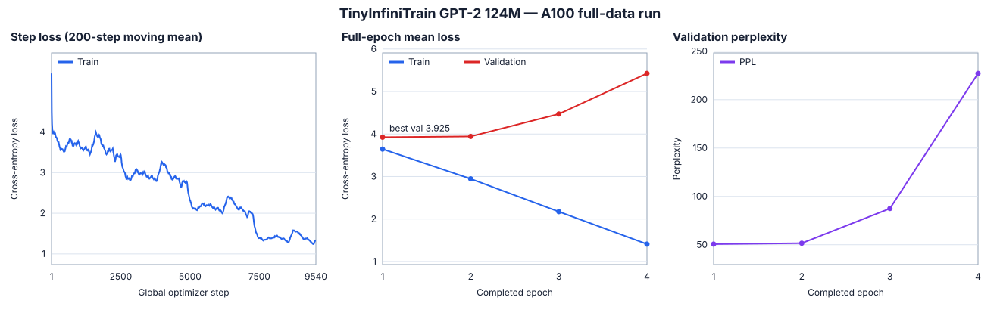

# TinyInfiniTrain 作业报告

## 提交说明

训练营提交页面只需要填写个人 fork 仓库地址和完成分支的最新 commit 链接，PR 与附件均留空。本仓库交付内容包括六项作业实现、未修改测试文件的公开测试结果、A100 完整数据训练实验，以及 loss、perplexity、生成文本、吞吐和显存指标。训练 checkpoint 体积较大，不纳入 Git 提交；仓库内保留足以复核结论的 CSV、JSON、曲线和固定 prompt 生成文本。

## 一、提交与测试验证

本次作业在提交分支的最新 commit 上完成最终验收。测试文件未作任何修改，以下结果均来自原有公开测试。

| 项目 | 验证环境 / 结果 |
| --- | --- |
| 编译器与 CUDA | GCC 13.4 / CUDA 12.6 |
| GPU | NVIDIA A100-SXM4-40GB |
| 构建 | complete |
| 7 个定向测例 | 7/7，100%，6.32 s |
| GPT-2 端到端测例 | `test_gpt2` 1/1，52.51 s |
| 全部公开测试 | 8/8 通过 |

### GPT-2 直接运行证据

为保留 `ctest` 汇总之外的端到端证据，在 NVIDIA A100-SXM4-40GB 上直接运行了
`test_gpt2`。输出包含固定随机种子的生成文本、100 个采样 logits 校验通过、GoogleTest PASS 和退出码 0。

本次直接运行耗时 52.611 s，生成文本开头为：

```text
The meaning of life is that it is continuous and play that might last.
Too little quickening. Art and tragedy and psychedelia, especially what I
call herws, don't emit a kind of absolutism and admiration for those lives.
```

数值验收输出为 `Logits validation passed with 100 samples`。测试中的比较阈值为绝对误差
`1e-3`；这证明当前短程训练轨迹与预置参考 logits 一致，但不等价于完整数据集收敛实验。

终端验收摘要如下（不以虚构截图代替日志）：

```text
revision: submission branch latest commit
environment: GCC 13.4, CUDA 12.6, NVIDIA A100-SXM4-40GB
build: complete
directed tests: 7/7 passed (100%), 6.32 s
test_gpt2: 1/1 passed, 52.51 s
public tests: 8/8 passed
```

## 二、六项作业实现

### 1. 自动微分 Neg 算子

**实现位置**：`infini_train/src/autograd/elementwise.cc`

**核心思路**：`Neg::Forward` 与 `Neg::Backward` 均通过统一 Dispatcher 按 Tensor 所在设备选择 CPU/CUDA kernel，避免在自动微分层直接分支实现设备逻辑。前向计算 `y=-x`，反向传播 `dx=-dy`。

**关键代码/公式**：

```text
y = -x
dx = dy * dy/dx = -dy
```

前向调用注册名 `NegForward`，反向调用 `NegBackward`，并以类型安全的 `Call` 接口传入 Tensor 参数。

**边界校验**：前向严格要求一个输入，反向严格要求一个输出梯度；设备类型来自实际 Tensor，由 Dispatcher 负责匹配已注册 kernel，缺失注册时直接报错而非静默回退。

### 2. CPU/CUDA MatMul 及反向传播

**实现位置**：

- `infini_train/src/kernels/cpu/linear.cc`
- `infini_train/src/kernels/cuda/linear.cu`

**核心思路**：CPU 使用 Eigen 的行主序矩阵映射并逐 batch 计算；CUDA 使用 `cublasSgemmStridedBatched` 完成批量矩阵乘法。输入形状为 `[..., M, K]` 和 `[..., K, N]`，输出为 `[..., M, N]`。

**关键代码/公式**：

```text
C  = A B
dA = dC B^T
dB = A^T dC
```

cuBLAS 按列主序解释内存，而框架 Tensor 为行主序，因此实现利用转置等价关系调整操作数顺序：

```text
C^T  = B^T A^T
dA^T = B dC^T
dB^T = dC^T A
```

**边界校验**：检查非空指针、FP32、CPU/CUDA 设备一致、rank 至少为 2、两侧 batch 维完全相等、内积维 `K` 相等；反向还检查 `grad_output` 的设备、类型与完整输出形状。CUDA 对零 batch 或 `M/N/K` 为零的情况直接返回正确形状的零 Tensor，避免非法 cuBLAS 调用。本实现不承诺 batch broadcasting，batch 前缀必须精确相同。

### 3. CPU/CUDA Adam 参数更新

**实现位置**：

- `infini_train/src/kernels/cpu/accumulate_grad.cc`
- `infini_train/src/kernels/cuda/accumulate_grad.cu`

**核心思路**：按调用合同原地更新一阶矩 `m`、二阶矩 `v` 与参数 `theta`；CPU 顺序遍历元素，CUDA 每个线程处理一个元素，线程块大小为 256。

**关键代码/公式**：

```text
m_t       = beta1 * m_(t-1) + (1 - beta1) * g
v_t       = beta2 * v_(t-1) + (1 - beta2) * g^2
m_hat     = m_t / (1 - beta1^t)
v_hat     = v_t / (1 - beta2^t)
theta_t   = theta_(t-1) - lr * m_hat / (sqrt(v_hat) + eps)
```

**边界校验**：参数、梯度、`m`、`v` 必须非空、均为 FP32、位于期望且相同的设备，四者形状必须完全一致，并要求时间步 `t > 0`，保证偏置修正分母有定义。CUDA 对零元素 Tensor 提前返回，不启动空 kernel。

### 4. Tensor Flatten、Backward 与子视图偏移

**实现位置**：`infini_train/src/tensor.cc`

**核心思路**：`Flatten` 规范化负维度，将 `[start_dim, end_dim]` 内各维相乘后构造新形状，再通过连续化与 `View` 返回结果。`Backward` 分别处理隐式梯度、显式梯度、叶子 Tensor 梯度累积和带 `grad_fn` 的链式反传。最终提交同时修正子 Tensor 的 offset：新视图 offset 相对父 Tensor 累加，同设备 `To` 不再重复累计已有 offset。

**关键代码/规则**：

```text
flattened_dim = product(dims[start_dim : end_dim + 1])
scalar Flatten -> shape [1]
scalar implicit backward seed -> 1
child absolute offset = parent offset + child relative offset
```

**边界校验**：检查 `start_dim/end_dim` 经负数归一化后均合法且 `start_dim <= end_dim`；`Backward` 要求 Tensor 开启梯度，非标量不得省略初始梯度，显式梯度必须与目标 Tensor 的形状、dtype、设备完全一致。当前实现明确拒绝 `retain_graph=true` 与 `create_graph=true`。

### 5. 类型安全的 Kernel Dispatcher

**实现位置**：`infini_train/include/dispatcher.h`

**核心思路**：以 `(DeviceType, kernel_name)` 为键保存 kernel。注册时只接受函数指针，并保存参数与返回值类型信息；调用时校验返回类型、参数数量、参数类型及左值/右值/const 语义，再通过 `std::invoke` 执行，避免将任意函数指针直接强转后调用造成未定义行为。

**关键代码/机制**：注册宏使用 `__COUNTER__` 生成唯一静态变量，并通过静态初始化 lambda 完成注册；同时将 kernel 标识符字符串化，保证调用名与注册名一致。`Call` 同时覆盖 `void` 与非 `void` 返回值。

**边界校验**：重复注册同一设备与名称、查找不存在的 kernel、实参与签名不一致、返回类型不一致时均立即失败；不会覆盖已有注册或进行隐式危险转换。

### 6. Tiny Shakespeare 数据集、Tokenizer 与文本生成

**实现位置**：

- `example/common/tiny_shakespeare_dataset.cc`
- `example/common/tokenizer.cc`

**核心思路**：数据集读取器严格解析 1024 B header，支持磁盘上的 uint16 GPT-2 token 与 uint32 LLaMA-3 token，并统一转换为模型需要的连续 INT64 Tensor。Tokenizer 解析词表 header 与逐 token 的长度前缀字节串。`GenerateText` 每一步从 logits `[B,T,V]` 中取 batch 0、位置 `t-1` 的词表向量，做 softmax 后复制到 CPU，使用固定 RNG 采样，将结果写回输入并同步到模型设备。

**关键代码/公式**：

```text
num_samples = floor((num_tokens - 1) / sequence_length)
x offset = sample_index * sequence_length * sizeof(int64_t)
y offset = x offset + sizeof(int64_t)
next-token logits = logits[0, t - 1, :]
```

生成过程保留确定性 RNG（初始状态 1337），并修复 RNG 状态变量自遮蔽。为避免多次只前向生成时保存无用 autograd 图，生成前暂时关闭模型参数的 `requires_grad`，由作用域保护对象在正常返回或异常退出时恢复原状态。

**边界校验**：

- 数据文件必须为普通文件，header 必须完整且 magic/version 合法，文件总长度必须严格等于 `1024 + num_tokens * token_width`，短读与尾随数据均拒绝；样本数必须大于零，最后一个 y view 不得越界。
- Tokenizer 检查文件最小长度、magic、版本、词表大小、EOT token 范围，并对每个 uint8 长度前缀和 token 字节做剩余长度检查；词表解析结束后不允许额外字节，越界 Decode 返回空字符串。
- 文本生成检查 batch/sequence 长度及 logits 的 `[B,T,V]` 形状，始终从 batch 0 的正确时间位置采样；每次写回后重新同步到目标设备。

## 三、范围说明与已知限制

1. 本次提交没有修改测试文件，最终结论以 A100 环境中原有 8 个公开测试全部通过为准。
2. 当前 autograd 引擎未承诺共享中间分支的完整梯度汇聚、真实多输出算子的通用反传，也不支持 `retain_graph` 或 `create_graph`；这些属于本次作业范围外能力。
3. MatMul 支持相同 batch 前缀上的批量计算，但未承诺 batch broadcasting；需要广播的输入应由上层先显式展开为兼容形状。

## 四、完整数据集训练与收敛实验

本节与第一节的公开测试验收严格分开：公开 `test_gpt2` 证明实现与参考短程轨迹一致；本节则使用专用 runner 在完整 Tiny Shakespeare train/validation split 上训练、验证、保存 checkpoint，并按预注册的 early-stopping 规则结束。

### 1. 实验配置与算力

| 项目 | 配置 / 实测 |
| --- | --- |
| 代码版本 | 提交分支最新 commit |
| GPU | 单卡 NVIDIA A100-SXM4-40GB |
| 软件环境 | GCC 13.4、CUDA 12.6 |
| 模型 | GPT-2 124M，FP32，预训练权重起点 |
| 序列 / batch | sequence length 64，batch size 2 |
| 优化器 | 基线实验为 Adam，lr `1e-4`，betas `(0.9, 0.999)`，epsilon `1e-8` |
| early stop | `min_delta=0.005`，`patience=3`，`max_epochs=30` |
| 随机种子 | 1337；训练数据顺序固定，生成采样也使用该种子 |
| 完整 train split | 305,260 raw tokens；4,769 samples；每 epoch 305,216 target tokens，43 transitions dropped |
| 完整 validation split | 32,768 raw tokens；511 samples；每次验证 32,704 target tokens，63 transitions dropped |
| 实际总量 | 9,540 Adam steps；1,220,864 train tokens；130,816 validation tokens |
| 调度资源 | 4 个最长 10 分钟的交互窗口；实际 job wall time 合计约 25.4 GPU-min（0.423 GPU-h） |

每个窗口都从 `latest.ckpt` 恢复完整模型、Adam `t/m/v`、训练 phase、epoch、batch cursor、累计指标、early-stop 状态和 RNG。第二窗口的新增记录严格从 global step `2802` 承接 `2801`；最终 `steps.csv` 中重复 global step 数为 0。checkpoint v2 对完整 body 使用 trailer checksum，并绑定输入文件身份、配置和 CUDA backend，损坏或跨 backend 恢复会直接拒绝。

### 2. Loss、perplexity 与 early stopping



| 完成 epoch | Global step | Train mean loss | Validation mean loss | Validation PPL | 是否刷新 best |
| ---: | ---: | ---: | ---: | ---: | :---: |
| 1 | 2,385 | 3.6451 | **3.9249** | **50.65** | 是 |
| 2 | 4,770 | 2.9450 | 3.9433 | 51.59 | 否 |
| 3 | 7,155 | 2.1730 | 4.4714 | 87.48 | 否 |
| 4 | 9,540 | **1.4092** | 5.4255 | 227.13 | 否，触发 early stop |

训练 loss 从第一个完整 epoch 的 3.6451 降至 1.4092，下降 61.34%，因此“loss 曲线下降”在 train split 上成立。但 validation loss 在第一个完整 epoch 达到最优后连续三次未改善，并在后期快速上升；这不是继续训练会改善的收敛形态，而是明确的过拟合。实验按预注册规则在第 4 个完整 epoch 后终止，没有为了得到更低 train loss 而跑满 30 epoch。

必须区分两个最终数值：

- **最佳泛化 checkpoint**：完成 epoch 1，validation loss `3.9249058558`，perplexity `50.6483`。
- **early-stop 时最后 checkpoint**：完成 epoch 4，train loss `1.4091759598`，validation loss `5.4255262690`，perplexity `227.1308`。

提交或下游推理应选择 `best.ckpt`，不能用过拟合后的 `final.ckpt` 冒充最佳模型。

### 3. 生成文本质量

三次生成使用同一 prompt `The meaning of life is`、同一 seed 和同一采样实现，只改变 checkpoint：

**训练前 baseline**：

```text
The meaning of life is that's what matters us. It's about everything that
actually matters to you. It means you are prepared to do anything and
everything to live a fulfilling, happy life.
```

**best checkpoint**：

```text
The meaning of life is of this country now
And not on this island.

<|endoftext|>SEBASTIAN:
Come, o' theel.
```

**early-stop final checkpoint**：

```text
The meaning of life is of very few words;
But most of all these say nothing.

<|endoftext|>NATHANIEL:
Then what is most concerning you, my friend and the duke,
```

微调后的文本明显获得 Tiny Shakespeare 的人物名、换行、戏剧对白和古风措辞，但 best 文本仍有畸形词，final 文本虽风格更强，validation PPL 却恶化到 227.13。因此这里只能声称“风格迁移可见”，不能仅凭三个样本声称通用生成质量提高；定量泛化结论仍以 validation loss/PPL 为准。

### 4. 吞吐、显存与产物

- 全程累计训练吞吐：`1,179.25 target tokens/s`；各完整 epoch 为 1,155.80、1,179.45、1,190.87、1,191.59 tokens/s。
- CUDA async default memory pool high-water：`3,008,656,476 B`，约 `2.80 GiB`。该指标只覆盖框架使用的 CUDA async pool，不等价于 `nvidia-smi` 的整卡峰值显存。
- 单个完整 Adam checkpoint：`1,493,932,197 B`，约 1.39 GiB。远端 `final.ckpt` 与 `latest.ckpt` 为同 inode 硬链接，best 为独立 checkpoint；最终目录实际占用约 2.8 GiB。
- 所有四个窗口均 `runner_exit_code=0`；最后 summary 为 `status=complete`、`run_state=complete`。

可复现实验入口：`example/gpt2/train_experiment.cc`。静态曲线生成命令：

```bash
python3 scripts/plot_full_experiment.py \
  docs/experiments/a100-full-seed1337 \
  docs/assets/full_training_curves_seed1337.svg
```

原始、未人工改写的指标与证据保存在 `docs/experiments/a100-full-seed1337/`：

- `steps.csv`：9,540 条逐 step loss、计算时间、吞吐与显存记录；
- `epochs.csv`：4 条完整 train/validation epoch 记录；
- `summary.json`：最终配置、数据覆盖、best/final 数值与 artifact 状态；
- `baseline.txt`、`best.txt`、`final.txt`：固定 prompt 生成文本。

本实验为单 seed、固定顺序的确定性训练，因此不报告伪造的多 seed 均值或方差。结论边界是：**完整数据覆盖、checkpoint 续跑、early-stop 收敛和单 seed 指标均已完成；跨 seed 稳健性未评估。**

### 5. 并行学习率 sweep 与推荐配置

为判断第 4 个 epoch 后停止是否只是学习率过大导致，本实验在独立 A100 上并行比较三档学习率。`1e-4` 直接复用前述完整实验；`5e-5` 与 `2e-5` 从同一个未微调 GPT-2 checkpoint 独立启动，固定 seed、数据顺序、batch、序列长度、验证集和 early-stopping 规则，只改变学习率。两个新实验分别使用独立输出目录和 checkpoint，不能相互续跑。

| 学习率 | Early-stop epoch | Best epoch | Best validation loss | Best validation PPL | Final train loss | Final validation loss |
| ---: | ---: | ---: | ---: | ---: | ---: | ---: |
| `1e-4` | 4 | 1 | 3.9249 | 50.65 | 1.4092 | 5.4255 |
| `5e-5` | 5 | 2 | 3.8118 | 45.23 | 1.3116 | 5.5715 |
| **`2e-5`** | **5** | **2** | **3.7102** | **40.86** | 2.2658 | 4.3182 |

在本次单 seed 对照中，`2e-5` 相对原 `1e-4` 将最佳 validation loss 降低约 5.47%，将 PPL 从 50.65 降到 40.86，降低约 19.32%。三档学习率后期都出现 train loss 继续下降、validation loss 上升，说明学习率调低能延缓并减轻过拟合，但不能消除小数据集上的过拟合。

因此 runner 默认值更新为：

- `learning_rate=2e-5`；
- `max_epochs=8`；
- `early_stopping_patience=3`；
- `min_delta=0.005`。

`max_epochs=8` 是保护上限，不代表必须跑满；`2e-5` 实际在完成 epoch 5 后 early-stop，应该使用 epoch 2 的 `best.ckpt`。两条新配置均通过 checkpoint 跨运行窗口精确续跑，最终各有 11,925 个唯一、连续的 global step。四个有效训练窗口实际合计约 64.3 GPU-min。

学习率 sweep 的原始证据位于 `docs/experiments/a100-lr-sweep-seed1337/`，包括每档的 `steps.csv`、`epochs.csv`、`summary.json` 和固定 prompt 文本。该比较仍是单 seed 选择实验，只能支持本作业配置推荐，不能声称具有跨 seed 的统计显著性。
